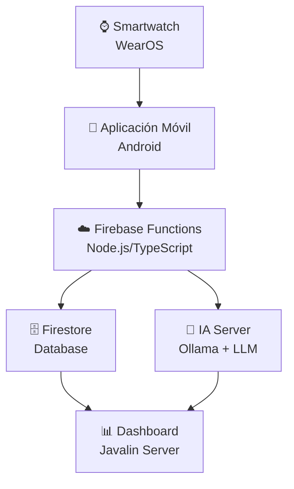

# 🌙 DreamApp - Aplicación IoT para Monitoreo del Sueño

<div align="center">


**Sistema integral de monitoreo y análisis inteligente de patrones de sueño**

[](https://kotlinlang.org/)
[](https://developer.android.com/)
[](https://firebase.google.com/)
[](https://javalin.io/)
[](https://www.docker.com/)

</div>

## Universidad Tecnológica Tula Tepeji

**Carrera**: Tecnologías de la Información  
**Materia**: Desarrollo de Aplicaciones IoT  
**Periodo**: 2026


## Descripción del Proyecto

**DreamApp** es un ecosistema completo de monitoreo del sueño que combina dispositivos wearables, aplicaciones móviles, servicios en la nube e inteligencia artificial para proporcionar análisis detallados y recomendaciones personalizadas sobre los patrones de sueño de los usuarios.

### Objetivos

- **Monitorear** las fases del sueño en tiempo real usando sensores wearables
- **Analizar** patrones y calidad del sueño con algoritmos avanzados
- **Proporcionar** recomendaciones personalizadas basadas en IA
- **Visualizar** datos históricos y tendencias de sueño
- **Mejorar** la calidad de vida a través de insights sobre el descanso

## Arquitectura del Sistema



### 🔄 Flujo de Procesamiento

**1. 📡 Captura en Tiempo Real (Smartwatch)**
- Sensores de frecuencia cardíaca y acelerómetro
- Cálculo de métricas HRV (RMSSD, SDNN) cada 30 segundos
- Detección automática de fases de sueño usando algoritmos locales
- Almacenamiento temporal en SQLite del reloj

**2. 📱 Agregación y Sincronización (Mobile)**
- Recepción de datos ya procesados del smartwatch
- Cálculo de métricas de sesión completa (eficiencia, promedios, calidad)
- Sincronización automática con Firebase cuando hay conectividad
- Visualización instantánea de estadísticas al despertar

**3. ☁️ Procesamiento en la Nube (Firebase)**
- Validación y almacenamiento de sesiones completas de sueño
- Análisis histórico y detección de patrones
- Generación de insights y recomendaciones personalizadas

**4. 🤖 Inteligencia Artificial (Local)**
- Procesamiento local de datos para mayor privacidad
- Análisis conversacional de patrones de sueño
- Recomendaciones basadas en modelos LLM especializados
    C --> E[🖥️ Javalin API<br/>Kotlin Server]
    E --> F[🤖 IA Server<br/>Ollama + WebUI]
    E --> D
    
    style A fill:#e1f5fe
    style B fill:#f3e5f5
    style C fill:#fff3e0
    style D fill:#e8f5e8
    style E fill:#fce4ec
    style F fill:#f1f8e9
```

### Flujo de Datos

1. **Captura**: El smartwatch recolecta datos de sensores (acelerómetro, giroscopio, pulso cardíaco)
2. **Transmisión**: Los datos se envían al dispositivo móvil vía Bluetooth
3. **Procesamiento**: La app móvil procesa y envía datos a Firebase Functions
4. **Almacenamiento**: Los datos se guardan en Firestore con validación y estructura
5. **Análisis**: El servidor Javalin procesa los datos para generar insights
6. **IA**: El servidor de IA genera recomendaciones personalizadas
7. **Visualización**: Los resultados se muestran en la aplicación móvil

## Estructura del Proyecto

```
aplicativo-iot/
├── 📱 WereableApp/              # Aplicación Android & WearOS
│   ├── appmobile/               # App móvil principal
│   ├── dashboardapp/            # Dashboard de administración
│   ├── mobile/                  # Módulo móvil compartido
│   └── wear/                    # Aplicación para smartwatch
│
├── ☁️ sleep-functions/          # Firebase Functions
│   ├── functions/               # Funciones serverless
│   │   ├── src/                 # Código fuente TypeScript
│   │   └── lib/                 # Código compilado
│   └── firestore.rules          # Reglas de seguridad
│
├── 🖥️ sleep-analysis-dreamapp-api/  # Servidor Javalin
│   ├── src/main/kotlin/         # Código fuente Kotlin
│   └── build.gradle.kts         # Configuración de dependencias
│
└── 🤖 ia-server/               # Servidor de Inteligencia Artificial
    └── ia/                     # Configuración Docker
        └── docker-compose.yaml # Ollama + Open WebUI
```

## Tecnologías Utilizadas

### Frontend & Mobile
- **Android Studio** - IDE principal
- **Kotlin** - Lenguaje para aplicaciones Android
- **Jetpack Compose** - UI moderna y reactiva
- **WearOS** - Sistema operativo para smartwatch
- **Material Design 3** - Sistema de diseño

### Backend & Cloud
- **Firebase Functions** - Funciones serverless
- **Firestore** - Base de datos NoSQL
- **Firebase Authentication** - Autenticación de usuarios
- **TypeScript** - Lenguaje para funciones cloud
- **Javalin** - Framework web ligero para Kotlin
- **Gradle** - Sistema de construcción

### Inteligencia Artificial
- **Ollama** - Motor de IA local
- **Open WebUI** - Interfaz conversacional
- **Docker** - Containerización
- **Modelos LLM** - Llama2, Mistral para análisis

### DevOps & Tools
- **Git & GitHub** - Control de versiones
- **Docker Compose** - Orquestación de contenedores
- **Firebase CLI** - Herramientas de desarrollo
- **Android Debug Bridge (ADB)** - Debugging

## Detalles Técnicos del Procesamiento

### 🌅 Experiencia al Despertar - Paso a Paso

**¿Qué ve el usuario cuando se despierta?**

1. **📱 Abre la aplicación móvil**
   - Las estadísticas ya están calculadas y listas
   - No hay tiempo de espera para procesamiento
   - Datos sincronizados automáticamente desde el reloj

2. **📊 Dashboard instantáneo muestra:**
   ```
   🌙 Resumen de tu sueño del 18/07/2025
   
   ⏰ Tiempo total: 7h 45min
   😴 Tiempo dormido: 7h 12min
   ✨ Eficiencia: 92.8%
   
   📈 Fases del sueño:
   💤 Sueño ligero: 3h 25min (47.6%)
   🔵 Sueño profundo: 2h 18min (32.1%)
   🌈 REM: 1h 29min (20.3%)
   
   ❤️ Frecuencia cardíaca:
   📊 Promedio: 58 BPM
   📉 Mínima: 52 BPM
   📈 Máxima: 72 BPM
   
   🏃 Movimiento promedio: 15/100
   🔄 Despertares: 2 veces
   ⭐ Calidad: EXCELENTE
   ```

3. **🤖 Recomendaciones IA:**
   - "Tu sueño profundo fue excepcional (32.1%)"
   - "Considera acostarte 15 min más temprano"
   - "Tu frecuencia cardíaca indica buen descanso"

4. **🔄 Sincronización en segundo plano:**
   - Los datos se envían a Firebase para análisis histórico
   - Disponibles para consulta médica si es necesario
   - Análisis de tendencias a largo plazo

**¡Todo esto sin esperas, porque el reloj ya hizo todo el trabajo pesado durante la noche!**

### 🔧 Algoritmos del Smartwatch

**Cálculo de HRV (Heart Rate Variability)**
```kotlin
// Cálculo de RMSSD a partir de 20 intervalos RR
private fun calculateRMSSD(rrIntervals: List<Long>): Double {
    val diffs = rrIntervals.zipWithNext { a, b -> b - a }
    val squaredDiffs = diffs.map { it * it }
    return sqrt(squaredDiffs.average())
}

// Cálculo de SDNN 
private fun calculateSDNN(rrIntervals: List<Long>): Double {
    val mean = rrIntervals.average()
    val variance = rrIntervals.map { (it - mean).pow(2) }.average()
    return sqrt(variance)
}
```

**Detección de Fases de Sueño**
```kotlin
// Tabla de referencia ajustada por edad del usuario
fun detectSleepPhase(bpm: Float, rmssd: Double, sdnn: Double, movement: Double): SleepPhase {
    val adjustedTable = adjustTableForUser(userData)
    return when {
        bpm in deepSleepRange && rmssd > 40 && movement < 0.4 -> SleepPhase.DEEP
        bpm in remSleepRange && rmssd in 30..39 && movement < 2.0 -> SleepPhase.REM
        bpm in lightSleepRange && rmssd in 10..29 && movement < 2.0 -> SleepPhase.LIGHT
        else -> SleepPhase.AWAKE
    }
}
```

**Flujo de Datos del Reloj**
1. **Captura cada 30 segundos**: HR, acelerómetro (X,Y,Z)
2. **Procesamiento inmediato**: Cálculo de HRV y magnitud de movimiento
3. **Detección de fase**: Algoritmo de scoring basado en tablas de referencia
4. **Almacenamiento local**: SQLite en el reloj como respaldo
5. **Transmisión al móvil**: Datos ya procesados y clasificados

### 📊 Métricas Calculadas en Tiempo Real

- **HRV RMSSD**: Variabilidad de intervalos RR consecutivos
- **HRV SDNN**: Desviación estándar de intervalos RR
- **Fase de Sueño**: LIGHT, DEEP, REM, AWAKE
- **Magnitud de Movimiento**: Calculada desde acelerómetro 3D
- **Calidad de Señal**: Validación de datos fisiológicos

## Instalación y Configuración

### Prerequisitos

- **Android Studio** (versión más reciente)
- **Node.js** 20+ 
- **Docker Desktop**
- **Firebase CLI**
- **Git**
- **JDK 21**

### 1. Clonar el Repositorio

### 2. Configurar Firebase

```bash
cd sleep-functions
npm install -g firebase-tools
firebase login
firebase init
```

### 3. Configurar el Servidor IA

```bash
cd ia-server/ia
docker-compose up -d
docker-compose exec ollama ollama pull llama2
```

### 4. Configurar Javalin Server

```bash
cd sleep-analysis-dreamapp-api
./gradlew build
./gradlew run
```

### 5. Configurar Aplicaciones Android

```bash
cd WereableApp
./gradlew build
```

## Uso del Sistema

### Para Usuarios Finales

1. **Instalar** la aplicación móvil desde Google Play Store
2. **Emparejar** el smartwatch con la aplicación
3. **Configurar** perfil de usuario y preferencias de sueño
4. **Usar** el smartwatch durante la noche para monitoreo
5. **Revisar** análisis y recomendaciones en la app móvil

### Para Desarrolladores

1. **Ejecutar** Firebase Functions localmente:
   ```bash
   cd sleep-functions/functions
   npm run serve
   ```

2. **Iniciar** servidor Javalin:
   ```bash
   cd sleep-analysis-dreamapp-api
   ./gradlew run
   ```

3. **Ejecutar** aplicación Android:
   ```bash
   cd WereableApp
   ./gradlew :appmobile:installDebug
   ```

## Características Principales

### 🌙 Procesamiento Inteligente en el Reloj
**DreamApp** implementa un enfoque innovador donde **todo el procesamiento crítico ocurre directamente en el smartwatch**, garantizando:

- **🔄 Cálculo en Tiempo Real**: El reloj calcula métricas HRV (RMSSD, SDNN) a partir de intervalos RR cada 30 segundos
- **🧠 Detección de Fases**: Algoritmos avanzados analizan frecuencia cardíaca, movimiento y HRV para detectar fases de sueño (LIGHT, DEEP, REM, AWAKE)
- **📊 Métricas Instantáneas**: Procesamiento local de datos fisiológicos sin depender de conectividad
- **🎯 Ajuste Personalizado**: Algoritmos adaptan tablas de referencia según edad y perfil del usuario

### 🌅 Experiencia al Despertar
**¡Al despertar, tus estadísticas de sueño ya están listas!**

Cuando el usuario se despierta y toma su teléfono:

1. **📱 Estadísticas Instantáneas**: Las métricas calculadas por el reloj se sincronizan automáticamente
2. **📈 Resumen Completo**: Visualización inmediata de:
   - Duración total del sueño
   - Tiempo en cada fase (ligero, profundo, REM)
   - Eficiencia del sueño (%)
   - Frecuencia cardíaca promedio/mín/máx
   - Calidad general del descanso
3. **🔄 Sincronización en Segundo Plano**: Los datos se envían a Firebase para análisis histórico
4. **🤖 Análisis IA**: Recomendaciones personalizadas basadas en la sesión de sueño

### Monitoreo del Sueño
- **Detección automática** de inicio y fin del sueño
- **Análisis de fases** (ligero, profundo, REM)
- **Monitoreo de frecuencia cardíaca** durante el sueño
- **Detección de movimientos** y despertares

### Análisis Inteligente
- **Patrones de sueño** a largo plazo
- **Calidad del descanso** con métricas personalizadas
- **Comparación** con estándares de salud
- **Tendencias** y correlaciones

### IA y Recomendaciones
- **Análisis conversacional** de datos de sueño
- **Recomendaciones personalizadas** para mejorar el descanso
- **Insights** basados en machine learning
- **Alertas** proactivas sobre patrones irregulares

### Experiencia de Usuario
- **Dashboard intuitivo** con visualizaciones claras
- **🌅 Estadísticas al despertar**: Métricas completas disponibles inmediatamente
- **📊 Procesamiento en tiempo real**: Cálculos realizados directamente en el reloj
- **🔄 Sincronización automática**: Datos enviados a la nube sin intervención del usuario
- **Notificaciones inteligentes** para recordatorios de sueño
- **Historial detallado** con gráficos interactivos
- **Exportación** de datos para análisis médico

## Seguridad y Privacidad

- **Encriptación** de datos sensibles de salud
- **Autenticación** robusta con Firebase Auth
- **Procesamiento local** de IA para mayor privacidad
- **Cumplimiento** de estándares de protección de datos
- **Control granular** de permisos de usuario

## Testing y Calidad

```bash
# Tests unitarios Android
./gradlew test

# Tests de integración Firebase
cd sleep-functions/functions
npm test

# Tests del servidor Javalin
cd sleep-analysis-dreamapp-api
./gradlew test
```

## Documentación Adicional

- [Guía de Desarrollo Android](./WereableApp/README.md)
- [Firebase Functions API](./sleep-functions/README.md)
- [Servidor Javalin](./sleep-analysis-dreamapp-api/README.md)
- [Configuración IA](./ia-server/README.md)


### Estándares de Código

- **Kotlin**: Seguir [Kotlin Coding Conventions](https://kotlinlang.org/docs/coding-conventions.html)
- **TypeScript**: Usar ESLint con configuración estándar
- **Commits**: Usar [Conventional Commits](https://www.conventionalcommits.org/)

## Licencia

Este proyecto es desarrollado como trabajo académico para la **Universidad Tecnológica Tula Tepeji**.

---

<div align="center">

**Desarrollado con 💜 por UTT Team v2**

*Mejorando la calidad del sueño a través de la tecnología*

</div>
