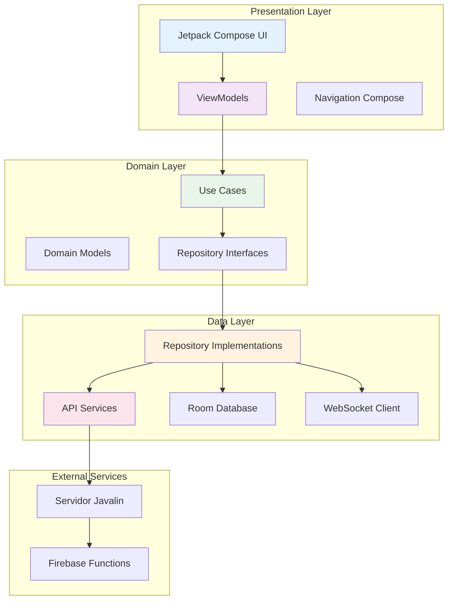

# NOX Dashboard - Aplicación Android para Médicos Especialistas

## Índice
1. [Introducción](#introducción)
2. [Objetivo General](#objetivo-general)
3. [Objetivos Específicos](#objetivos-específicos)
4. [Arquitectura de la Aplicación](#arquitectura-de-la-aplicación)
5. [Tecnologías y Dependencias](#tecnologías-y-dependencias)
6. [Estructura del Proyecto](#estructura-del-proyecto)
7. [Configuración del Proyecto](#configuración-del-proyecto)
8. [Módulos Principales](#módulos-principales)
9. [Capas de Arquitectura Clean](#capas-de-arquitectura-clean)
10. [Navegación y UI](#navegación-y-ui)
11. [Gestión de Estado](#gestión-de-estado)
12. [Integración con Backend](#integración-con-backend)
13. [Base de Datos Local](#base-de-datos-local)
14. [WebSocket en Tiempo Real](#websocket-en-tiempo-real)
15. [Configuración de Build](#configuración-de-build)
16. [Testing](#testing)
17. [Despliegue](#despliegue)
18. [Créditos](#créditos)

---

## Introducción

**`dashboardapp`** es la aplicación Android especializada para médicos del sistema **NOX** de **XIADANOS Corporation S.A.**, desarrollada con Jetpack Compose y arquitectura Clean. Esta aplicación permite a profesionales de la salud autenticarse de forma segura, visualizar listas de pacientes en tiempo real, analizar estadísticas detalladas de sueño y consultar predicciones basadas en inteligencia artificial.

La aplicación actúa como frontend médico que consume el servidor Javalin (`sleep-analysis-dreamapp-api`) para obtener datos procesados, estadísticas avanzadas y predicciones de IA, proporcionando una interfaz moderna y intuitiva para el análisis médico especializado.

## Objetivo General

Desarrollar una aplicación Android moderna y eficiente que permita a médicos especialistas acceder de forma segura y en tiempo real a análisis completos de datos de sueño de pacientes, incluyendo visualización de estadísticas temporales, gráficos interactivos y predicciones de inteligencia artificial para facilitar el diagnóstico y tratamiento de trastornos del sueño.

## Objetivos Específicos

- **Implementar autenticación segura** para médicos con gestión de sesiones persistentes
- **Proporcionar interfaz moderna** con Jetpack Compose y Material Design 3
- **Visualizar datos en tiempo real** mediante WebSocket para actualizaciones automáticas de pacientes
- **Generar gráficos interactivos** de estadísticas de sueño con bibliotecas especializadas (Vico Charts)
- **Consultar predicciones de IA** del próximo mes para análisis predictivo
- **Gestionar datos offline** con Room Database para funcionamiento sin conexión
- **Optimizar rendimiento** con inyección de dependencias Hilt y arquitectura Clean
- **Facilitar navegación intuitiva** entre pantallas con Navigation Compose

## Arquitectura de la Aplicación



### Principios de Arquitectura

1. **Clean Architecture**: Separación clara de responsabilidades en capas
2. **MVVM Pattern**: Model-View-ViewModel para gestión de estado
3. **Single Source of Truth**: Room Database como fuente única de verdad
4. **Reactive Programming**: Flows y StateFlow para programación reactiva
5. **Dependency Injection**: Hilt para gestión automática de dependencias

## Tecnologías y Dependencias

### Framework Principal
- **Android SDK 35**: Plataforma de desarrollo Android más reciente
- **Kotlin**: Lenguaje de programación principal con corrutinas
- **Jetpack Compose**: UI toolkit declarativo moderno
- **Material Design 3**: Sistema de diseño de Google

### Arquitectura y Navegación
- **Navigation Compose**: Navegación declarativa entre pantallas
- **Hilt (Dagger)**: Inyección de dependencias automática
- **Architecture Components**: ViewModel, LiveData, StateFlow

### Networking y Comunicación
- **Retrofit 2**: Cliente HTTP para consumo de APIs REST
- **OkHttp**: Cliente HTTP con interceptores de logging
- **Gson**: Serialización/deserialización JSON
- **WebSocket**: Comunicación en tiempo real con servidor

### Base de Datos Local
- **Room**: ORM para SQLite con tipo-safety
- **Kotlin Coroutines**: Programación asíncrona para operaciones de BD
- **Database Inspector**: Herramientas de debugging para BD

### UI y Visualización
- **Coil**: Librería de carga de imágenes para Compose
- **Vico Charts**: Biblioteca de gráficos interactivos para estadísticas
- **Material Icons Extended**: Conjunto completo de iconos Material

### Testing y Debugging
- **JUnit**: Framework de testing unitario
- **Espresso**: Testing de UI automatizado
- **Compose Testing**: Herramientas específicas para testing de Compose

## Estructura del Proyecto

### Organización de Directorios

```
dashboardapp/
├── build.gradle.kts                 # Configuración de build
├── proguard-rules.pro              # Reglas de ofuscación
└── src/main/java/com/example/dashboardapp/
    ├── MainActivity.kt              # Actividad principal
    ├── MyApp.kt                     # Aplicación Hilt
    ├── data/                        # Capa de datos
    │   ├── local/                   # Base de datos local
    │   │   ├── dao/                 # Data Access Objects
    │   │   ├── entities/            # Entidades Room
    │   │   ├── session/             # Gestión de sesiones
    │   │   └── AppDatabase.kt       # Configuración Room
    │   ├── remote/                  # Servicios remotos
    │   │   ├── api/                 # Interfaces Retrofit
    │   │   │   ├── auth/           # APIs de autenticación
    │   │   │   ├── sleep/          # APIs de estadísticas
    │   │   │   └── user/           # APIs de usuarios
    │   │   ├── dto/                # Data Transfer Objects
    │   │   ├── helpers/            # Helpers de red
    │   │   └── NetworkModule.kt    # Configuración de red
    │   └── repository/             # Implementaciones de repositorio
    ├── di/                         # Inyección de dependencias
    │   └── AppModule.kt            # Módulo principal Hilt
    ├── domain/                     # Lógica de negocio
    │   ├── model/                  # Modelos de dominio
    │   ├── repository/             # Interfaces de repositorio
    │   ├── usecase/                # Casos de uso
    │   └── utils/                  # Utilidades de dominio
    ├── presentation/               # Capa de presentación
    │   ├── navigation/             # Navegación Compose
    │   ├── ui/                     # Pantallas y componentes
    │   │   ├── components/         # Componentes reutilizables
    │   │   └── screens/            # Pantallas principales
    │   │       ├── dashboard/      # Dashboard principal
    │   │       ├── login/          # Autenticación
    │   │       ├── register/       # Registro de médicos
    │   │       └── stats/          # Estadísticas de sueño
    │   └── viewmodel/              # ViewModels
    ├── ui/                         # Tema y estilos
    │   └── theme/                  # Configuración Material Design
    └── utils/                      # Utilidades generales
```

## Configuración del Proyecto

### Build Configuration (build.gradle.kts)

```kotlin
// AQUÍ VA LA CONFIGURACIÓN DE build.gradle.kts
// Plugins: Android Application, Kotlin, Compose, Hilt
// Configuración SDK: compileSdk 35, minSdk 30, targetSdk 35
// BuildTypes: debug y release con configuraciones específicas
// Dependencies: todas las librerías mencionadas anteriormente
```

### Application Class (MyApp.kt)

```kotlin
// AQUÍ VA LA CLASE MyApp
// Anotación @HiltAndroidApp para inicializar Hilt
// Extiende Application para configuración global
```

### MainActivity (MainActivity.kt)

```kotlin
// AQUÍ VA LA CLASE MainActivity
// Anotación @AndroidEntryPoint para inyección Hilt
// Configuración de Compose con AppNavHost
// Gestión de SessionManager y NavController
```

## Módulos Principales

### 1. Módulo de Autenticación

#### **Objetivo**: Gestionar login, registro y logout de médicos especialistas

#### **Componentes**:

##### **Data Layer**
```kotlin
// AQUÍ VA AuthApiService.kt
// Interface Retrofit con endpoints:
// - POST /auth/login
// - POST /account (registro)
// - POST /auth/logout

// AQUÍ VA LoginRequestDto.kt
// Data class con userName, password, role

// AQUÍ VA LoginResponseDto.kt  
// Data class con success, data (UserInfo)

// AQUÍ VA AuthRepositoryImpl.kt
// Implementación que combina API + Room Database
// Gestión de cache local de datos de usuario
```

##### **Domain Layer**
```kotlin
// AQUÍ VA AuthRepository.kt (interface)
// Contratos para autenticación: login, register, logout

// AQUÍ VA LoginUseCase.kt
// Lógica de negocio para autenticación
// Validación de credenciales y gestión de errores

// AQUÍ VA RegisterUseCase.kt
// Caso de uso para registro de nuevos médicos

// AQUÍ VA LogoutUseCase.kt
// Limpieza de sesión y datos locales

// AQUÍ VA User.kt (domain model)
// Entidad del dominio con datos del médico
```

##### **Presentation Layer**
```kotlin
// AQUÍ VA LoginViewModel.kt
// StateFlow para estado de UI
// Coordinación entre UseCase y UI
// Manejo de estados de carga y errores

// AQUÍ VA LoginScreen.kt
// Composable principal de login
// Formulario con validación
// Navegación a dashboard o registro

// AQUÍ VA RegisterScreen.kt
// Formulable de registro de médicos
// Validación de campos obligatorios
```

### 2. Módulo de Dashboard y Usuarios

#### **Objetivo**: Mostrar lista de pacientes en tiempo real con WebSocket

#### **Componentes**:

##### **Data Layer**
```kotlin
// AQUÍ VA UserApiService.kt
// Interface Retrofit: GET /users

// AQUÍ VA UserDto.kt
// DTO con id, name, weight, height, age, sex, pictureUrl

// AQUÍ VA UserDao.kt
// Room DAO para operaciones CRUD de usuarios locales

// AQUÍ VA UserEntity.kt
// Entidad Room para cache local de usuarios

// AQUÍ VA UserRepositoryImpl.kt
// Implementación con API + Room + WebSocket
// Sincronización de datos locales con servidor
```

##### **Domain Layer**
```kotlin
// AQUÍ VA UserRepository.kt (interface)
// Contratos para obtener usuarios y gestionar WebSocket

// AQUÍ VA GetAllUsersUseCase.kt
// Caso de uso para obtener lista de pacientes
// Lógica de cache y actualización

// AQUÍ VA User.kt (domain model)
// Modelo de dominio con datos del paciente
```

##### **Presentation Layer**
```kotlin
// AQUÍ VA DashboardViewModel.kt
// StateFlow de lista de usuarios
// Gestión de conexión WebSocket
// Estados de carga y errores

// AQUÍ VA DashboardScreen.kt
// Composable con lista de pacientes
// LazyColumn con elementos clickeables
// Botón de logout y refresh

// AQUÍ VA UserItem.kt
// Composable para item individual de usuario
// Card con foto, nombre y datos básicos
```

### 3. Módulo de Estadísticas de Sueño

#### **Objetivo**: Visualizar análisis completo de datos de sueño por paciente

#### **Componentes**:

##### **Data Layer**
```kotlin
// AQUÍ VA SleepApiService.kt
// Interface Retrofit: GET /sleep/stats?uid={userId}

// AQUÍ VA StatsByUserResponseDto.kt
// DTO complejo con efficiencyChart, qualityPie, averages

// AQUÍ VA SleepRepositoryImpl.kt
// Implementación que consume API de estadísticas
// Mapeo de DTOs a modelos de dominio
```

##### **Domain Layer**
```kotlin
// AQUÍ VA SleepRepository.kt (interface)
// Contrato para obtener estadísticas por usuario

// AQUÍ VA GetSleepStatsByUserUseCase.kt
// Caso de uso para procesar estadísticas
// Validación y transformación de datos

// AQUÍ VA SleepStats.kt (domain model)
// Modelo de dominio con todas las estadísticas
```

##### **Presentation Layer**
```kotlin
// AQUÍ VA StatsViewModel.kt
// StateFlow de estadísticas cargadas
// Gestión de estado de carga
// Manejo de errores de red

// AQUÍ VA StatsScreen.kt
// Composable principal con gráficos
// TabRow para diferentes vistas temporales
// Integración con Vico Charts

// AQUÍ VA EfficiencyChart.kt
// Componente de gráfico de líneas
// Configuración de ejes y datos

// AQUÍ VA QualityPieChart.kt
// Componente de gráfico circular
// Distribución de calidad de sueño

// AQUÍ VA AveragesCard.kt
// Tarjeta con métricas promedio
// Diseño responsive con Material 3
```

### 4. Módulo de Predicciones de IA

#### **Objetivo**: Mostrar predicciones del próximo mes generadas por IA

#### **Componentes**:

##### **Data Layer**
```kotlin
// AQUÍ VA SleepPredictionApiService.kt
// Interface Retrofit: GET /ai/predictions-next-month-efficiency?uid={userId}

// AQUÍ VA PredictionResponseDto.kt
// DTO con array de predicciones por fecha

// AQUÍ VA SleepPredictionRepositoryImpl.kt
// Implementación que consume API de predicciones IA
```

##### **Domain Layer**
```kotlin
// AQUÍ VA SleepPredictionRepository.kt (interface)
// Contrato para obtener predicciones

// AQUÍ VA GetPredictEfficiencyNextMonthUseCase.kt
// Caso de uso para procesar predicciones
// Validación de datos de IA

// AQUÍ VA SleepPrediction.kt (domain model)
// Modelo con date y sleepEfficiency predicha
```

##### **Presentation Layer**
```kotlin
// AQUÍ VA PredictionChart.kt
// Componente de gráfico de predicciones
// Línea temporal de 30 días futuros
// Diferenciación visual entre histórico y predicho

// AQUÍ VA PredictionSummary.kt
// Resumen de tendencias predichas
// Métricas calculadas sobre predicciones
```

## Capas de Arquitectura Clean

### **Data Layer (Capa de Datos)**

#### **Responsabilidades**:
- Acceso a APIs remotas via Retrofit
- Gestión de base de datos local con Room
- Implementación de repositorios definidos en Domain
- Comunicación WebSocket en tiempo real
- Cache y sincronización de datos

#### **Estructura**:
```
data/
├── local/
│   ├── dao/                     # Data Access Objects Room
│   │   └── UserDao.kt          # AQUÍ VA USERDAO CON @Query ANNOTATIONS
│   ├── entities/               # Entidades Room
│   │   └── UserEntity.kt       # AQUÍ VA USERENTITY CON @Entity
│   ├── session/                # Gestión de sesiones
│   │   └── SessionManager.kt   # AQUÍ VA SESSIONMANAGER CON SHAREDPREFERENCES
│   └── AppDatabase.kt          # AQUÍ VA APPDATABASE CON @Database
├── remote/
│   ├── api/                    # Interfaces Retrofit
│   ├── dto/                    # Data Transfer Objects
│   └── helpers/                # Helpers de red y WebSocket
└── repository/                 # Implementaciones de repositorio
    ├── auth/
    ├── sleep/
    └── user/
```

### **Domain Layer (Capa de Dominio)**

#### **Responsabilidades**:
- Definición de modelos de negocio
- Casos de uso (lógica de negocio)
- Interfaces de repositorio
- Reglas de negocio independientes de framework

#### **Estructura**:
```
domain/
├── model/                      # Modelos de dominio
│   ├── auth/
│   │   └── User.kt            # AQUÍ VA USER DOMAIN MODEL
│   ├── sleep/
│   │   └── SleepStats.kt      # AQUÍ VA SLEEPSTATS DOMAIN MODEL
│   └── user/
├── repository/                 # Interfaces de repositorio
│   ├── auth/
│   │   └── AuthRepository.kt  # AQUÍ VA AUTHREPOSITORY INTERFACE
│   ├── sleep/
│   └── user/
├── usecase/                   # Casos de uso
│   ├── auth/
│   │   ├── LoginUseCase.kt    # AQUÍ VA LOGINUSECASE
│   │   └── LogoutUseCase.kt   # AQUÍ VA LOGOUTUSECASE
│   ├── sleep/
│   └── user/
└── utils/                     # Utilidades de dominio
```

### **Presentation Layer (Capa de Presentación)**

#### **Responsabilidades**:
- ViewModels para gestión de estado
- Composables de UI
- Navegación entre pantallas
- Manejo de eventos de usuario

#### **Estructura**:
```
presentation/
├── navigation/
│   └── AppNavHost.kt          # AQUÍ VA APPNAVHOST CON NAVIGATION COMPOSE
├── ui/
│   ├── components/            # Componentes reutilizables
│   │   ├── LoadingIndicator.kt # AQUÍ VA LOADINGINDICATOR COMPOSABLE
│   │   └── ErrorMessage.kt    # AQUÍ VA ERRORMESSAGE COMPOSABLE
│   └── screens/               # Pantallas principales
│       ├── dashboard/
│       │   └── DashboardScreen.kt # AQUÍ VA DASHBOARDSCREEN COMPOSABLE
│       ├── login/
│       │   └── LoginScreen.kt     # AQUÍ VA LOGINSCREEN COMPOSABLE
│       ├── register/
│       │   └── RegisterScreen.kt  # AQUÍ VA REGISTERSCREEN COMPOSABLE
│       └── stats/
│           └── StatsScreen.kt     # AQUÍ VA STATSSCREEN COMPOSABLE
└── viewmodel/                 # ViewModels
    ├── auth/
    │   └── LoginViewModel.kt  # AQUÍ VA LOGINVIEWMODEL CON STATEFLOW
    ├── dashboard/
    │   └── DashboardViewModel.kt # AQUÍ VA DASHBOARDVIEWMODEL
    └── stats/
        └── StatsViewModel.kt     # AQUÍ VA STATSVIEWMODEL
```

## Navegación y UI

### **Navigation Compose**

#### **Configuración de Rutas**:
```kotlin
// AQUÍ VA OBJECT Routes
// Constantes para todas las rutas de navegación
// LOGIN, DASHBOARD, REGISTER, STATS
// Funciones helper para rutas con parámetros
```

#### **NavHost Principal**:
```kotlin
// AQUÍ VA FUNCIÓN AppNavHost
// NavHost con todas las pantallas definidas
// Gestión de argumentos entre pantallas
// Control de navegación condicional basado en sesión
```

### **Gestión de Sesiones**:
```kotlin
// AQUÍ VA CLASE SessionManager
// SharedPreferences para persistencia de sesión
// Métodos: isLoggedIn(), saveUser(), clearSession()
// Integración con navegación automática
```

### **Temas y Estilos**:
```
ui/theme/
├── Color.kt                   # AQUÍ VA CONFIGURACIÓN DE COLORES MATERIAL 3
├── Type.kt                    # AQUÍ VA TIPOGRAFÍA PERSONALIZADA
├── Theme.kt                   # AQUÍ VA TEMA PRINCIPAL
└── Shape.kt                   # AQUÍ VA FORMAS Y BORDES
```

## Gestión de Estado

### **StateFlow y Compose State**

#### **Patrones de Estado**:
```kotlin
// AQUÍ VA PATRÓN DE UISTATE
// Sealed class para estados: Loading, Success, Error
// StateFlow en ViewModels para estado reactivo
// collectAsState() en Composables
```

#### **Estados por Pantalla**:

##### **LoginScreen State**:
```kotlin
// AQUÍ VA LoginUiState
// data class con isLoading, errorMessage, isSuccess
// Gestión de formulario con validación
```

##### **DashboardScreen State**:
```kotlin
// AQUÍ VA DashboardUiState  
// data class con users: List<User>, isLoading, errorMessage
// Estado de conexión WebSocket
```

##### **StatsScreen State**:
```kotlin
// AQUÍ VA StatsUiState
// data class con sleepStats, predictions, isLoading
// Estados separados para gráficos y predicciones
```

## Integración con Backend

### **Configuración de Retrofit**

#### **Base URL y Configuración**:
```kotlin
// AQUÍ VA CONFIGURACIÓN EN AppModule
// Base URL: http://192.168.137.1:7070 (servidor Javalin)
// Timeouts: 5 minutos para conexión/lectura/escritura
// GsonConverterFactory para serialización JSON
```

#### **Interceptors y Logging**:
```kotlin
// AQUÍ VA CONFIGURACIÓN DE OKHTTP
// LoggingInterceptor para debug de requests
// Timeouts extendidos para operaciones de IA
// Headers automáticos si es necesario
```

### **Servicios API**

#### **AuthApiService**:
```kotlin
// AQUÍ VA AUTHAPI SERVICE
// @POST("/auth/login") con LoginRequestDto
// @POST("/account") para registro
// @POST("/auth/logout") para cerrar sesión
```

#### **UserApiService**:
```kotlin
// AQUÍ VA USERAPI SERVICE  
// @GET("/users") para obtener lista de pacientes
// Respuesta: List<UserDto> desde Firebase Functions
```

#### **SleepApiService**:
```kotlin
// AQUÍ VA SLEEPAPI SERVICE
// @GET("/sleep/stats") con @Query("uid")
// Respuesta: StatsByUserResponseDto con gráficos y métricas
```

#### **SleepPredictionApiService**:
```kotlin
// AQUÍ VA SLEEPPREDICTIONAPI SERVICE
// @GET("/ai/predictions-next-month-efficiency") con @Query("uid")
// Respuesta: PredictionResponseDto con 30 días de predicciones
```

## Base de Datos Local

### **Room Database Configuration**

#### **AppDatabase**:
```kotlin
// AQUÍ VA APPDATABASE
// @Database con entities y version
// Singleton con Room.databaseBuilder
// fallbackToDestructiveMigration() para desarrollo
```

#### **Entities**:
```kotlin
// AQUÍ VA USERENTITY
// @Entity con @PrimaryKey
// Campos: id, name, weight, height, age, sex, pictureUrl
// Mapeo desde/hacia User domain model
```

#### **DAOs**:
```kotlin
// AQUÍ VA USERDAO
// @Dao con @Query, @Insert, @Update, @Delete
// Métodos suspend para operaciones asíncronas
// Flow<List<UserEntity>> para observación reactiva
```

### **Estrategia de Cache**

#### **Patrón Repository**:
1. **Consultar cache local** (Room) primero
2. **Mostrar datos cached** inmediatamente si existen
3. **Hacer request API** en background
4. **Actualizar cache** con datos frescos
5. **Emitir datos actualizados** via Flow

#### **Sincronización**:
```kotlin
// AQUÍ VA LÓGICA DE SINCRONIZACIÓN
// Comparación de timestamps para datos frescos
// Merge de datos locales y remotos
// Resolución de conflictos con preferencia remota
```

## WebSocket en Tiempo Real

### **Configuración WebSocket**

#### **URL y Conexión**:
```kotlin
// AQUÍ VA CONFIGURACIÓN WEBSOCKET
// URL: ws://192.168.137.1:7070/ws/users
// Conexión automática al entrar al dashboard
// Reconexión automática en caso de pérdida
```

#### **Gestión de Mensajes**:
```kotlin
// AQUÍ VA WEBSOCKET MANAGER
// Parsing de mensajes JSON a List<UserDto>
// Actualización automática de Room Database
// Notificación a UI via StateFlow
```

### **Flujo en Tiempo Real**:

1. **Conexión**: Al abrir DashboardScreen
2. **Mensaje inicial**: Servidor envía lista actual de usuarios
3. **Actualizaciones**: Cuando nuevos pacientes se registran
4. **Sincronización**: Update automático en Room + UI
5. **Desconexión**: Al salir del dashboard o cerrar app

## Configuración de Build

### **Android Configuration**

#### **SDK Versions**:
```gradle
// AQUÍ VA CONFIGURACIÓN SDK
// compileSdk = 35 (Android 15)
// minSdk = 30 (Android 11) para funcionalidades modernas
// targetSdk = 35 para compatibilidad completa
```

#### **Build Types**:
```gradle
// AQUÍ VA BUILD TYPES
// debug: isDebuggable = true, sin minificación
// release: minificación habilitada, ProGuard rules
// buildConfigField para configuraciones específicas
```

#### **Compose Configuration**:
```gradle
// AQUÍ VA COMPOSE CONFIG
// buildFeatures { compose = true }
// composeOptions con kotlinCompilerExtensionVersion
// Kotlin target compatibility 11
```

### **Dependencies Management**

#### **Version Catalog** (libs.versions.toml):
```toml
# AQUÍ VA VERSION CATALOG
# Centralización de versiones de dependencias
# Grupos por funcionalidad: compose, hilt, room, retrofit
# Facilita actualizaciones y mantenimiento
```

#### **Proguard Rules**:
```proguard
# AQUÍ VAN REGLAS PROGUARD
# Keepnames para modelos de datos (Gson)
# Reglas específicas para Room, Retrofit, Hilt
# Optimización para APK de producción
```

## Testing

### **Unit Testing**

#### **Repository Testing**:
```kotlin
// AQUÍ VA TESTING DE REPOSITORIOS
// MockWebServer para APIs
// In-memory Room database para DAOs
// Coroutines Test para operaciones asíncronas
```

#### **UseCase Testing**:
```kotlin
// AQUÍ VA TESTING DE USECASES
// Mock repositories con Mockito
// Verificación de lógica de negocio
// Testing de casos de error
```

#### **ViewModel Testing**:
```kotlin
// AQUÍ VA TESTING DE VIEWMODELS
// TestCoroutineDispatcher para corrutinas
// StateFlow testing con turbine
// Verification de estados de UI
```

### **UI Testing**

#### **Compose Testing**:
```kotlin
// AQUÍ VA TESTING DE COMPOSE
// createComposeRule() para testing de Composables
// Semantics matchers para elementos de UI
// Testing de navegación entre pantallas
```

#### **Integration Testing**:
```kotlin
// AQUÍ VA INTEGRATION TESTING
// End-to-end testing con Hilt
// Room database real en testing
// Network testing con mock responses
```

## Despliegue

### **Debug Build**

#### **Configuración Local**:
```bash
# Conectar dispositivo Android o iniciar emulador
./gradlew assembleDebug

# Instalar APK
adb install app/build/outputs/apk/debug/app-debug.apk

# Ver logs en tiempo real
adb logcat | grep "DashboardApp"
```

#### **Testing en Red Local**:
```bash
# Verificar conectividad con servidor Javalin
adb shell am start -W -a android.intent.action.VIEW -d "http://192.168.137.1:7070" com.android.browser

# Verificar WebSocket connection
# Usar herramientas de network debugging en Android Studio
```

### **Release Build**

#### **Generación de APK**:
```bash
# Build optimizado para producción
./gradlew assembleRelease

# APK ubicado en:
# app/build/outputs/apk/release/app-release.apk
```

#### **App Bundle (Google Play)**:
```bash
# Generar App Bundle para Play Store
./gradlew bundleRelease

# Bundle ubicado en:
# app/build/outputs/bundle/release/app-release.aab
```

### **Configuración de Firma**

#### **Keystore Configuration**:
```gradle
// AQUÍ VA CONFIGURACIÓN DE KEYSTORE
// signingConfigs para debug y release
// Keystore path y passwords
// Key alias para identificación
```

#### **Security Best Practices**:
```gradle
// AQUÍ VAN PRÁCTICAS DE SEGURIDAD
// Ofuscación de código sensible
// Hardening de configuraciones de red
// Verificación de certificados SSL
```

## Capturas de Pantalla de la Aplicación

### **Vista General de la Aplicación**

La aplicación NOX Dashboard para médicos presenta una interfaz moderna y profesional diseñada con Material Design 3 y Jetpack Compose. A continuación se muestran las capturas de pantalla de cada vista principal con sus funcionalidades detalladas.

---

### **1. Pantalla de Inicio de Sesión (LoginScreen)**

#### **Descripción**:
Pantalla de autenticación para médicos especialistas con formulario de login seguro, validación en tiempo real y diseño responsive.

#### **Funcionalidades Visibles**:
- **Campo de Usuario**: Input con validación de formato
- **Campo de Contraseña**: Input con visibility toggle
- **Selector de Rol**: Dropdown con opciones ADMIN, SYSADMIN, CLIENT
- **Botón de Login**: Con loading indicator durante autenticación
- **Link de Registro**: Navegación a pantalla de registro
- **Indicadores de Error**: Mensajes descriptivos para errores de autenticación

#### **Imagen**:
```
📱 AQUÍ VA LA CAPTURA DE LOGINSCREEN
Ubicación sugerida: /docs/screenshots/01-login-screen.png
Tamaño recomendado: 1080x2400 (aspect ratio 9:21)
```

**Estados a Capturar**:
- ✅ Estado normal del formulario
- ✅ Estado de validación con errores
- ✅ Estado de loading durante login
- ✅ Dropdown de roles desplegado

---

### **2. Pantalla de Registro (RegisterScreen)**

#### **Descripción**:
Formulario de registro para nuevos médicos especialistas con validación completa y diseño consistente con Material Design 3.

#### **Funcionalidades Visibles**:
- **Campo de Usuario**: Input con validación de unicidad
- **Campo de Contraseña**: Input con indicador de fortaleza
- **Confirmar Contraseña**: Validación de coincidencia
- **Selector de Rol**: Opciones disponibles según permisos
- **Botón de Registro**: Con animación de loading
- **Link de Login**: Navegación a pantalla de login
- **Validaciones en Tiempo Real**: Feedback inmediato por campo

#### **Imagen**:
```
📱 AQUÍ VA LA CAPTURA DE REGISTERSCREEN
Ubicación sugerida: /docs/screenshots/02-register-screen.png
Tamaño recomendado: 1080x2400 (aspect ratio 9:21)
```

**Estados a Capturar**:
- ✅ Formulario vacío inicial
- ✅ Validación de campos en tiempo real
- ✅ Estado de loading durante registro
- ✅ Confirmación de registro exitoso

---

### **3. Pantalla Principal - Dashboard (DashboardScreen)**

#### **Descripción**:
Vista principal con lista de pacientes en tiempo real, actualizada via WebSocket. Diseño con cards responsive y navegación intuitiva.

#### **Funcionalidades Visibles**:
- **AppBar Superior**: Logo NOX, título y botón de logout
- **Lista de Pacientes**: LazyColumn con UserItem cards
- **Información por Paciente**:
  - Foto de perfil (Coil image loading)
  - Nombre completo
  - Edad y sexo
  - Peso y altura
  - Indicador de conexión en tiempo real
- **Botón de Refresh**: Pull-to-refresh y botón manual
- **FAB**: Floating Action Button para acciones rápidas
- **Indicadores de Estado**: Loading, error, vacío

#### **Imagen**:
```
📱 AQUÍ VA LA CAPTURA DE DASHBOARDSCREEN
Ubicación sugerida: /docs/screenshots/03-dashboard-screen.png
Tamaño recomendado: 1080x2400 (aspect ratio 9:21)
```

**Estados a Capturar**:
- ✅ Lista completa de pacientes
- ✅ Estado de loading inicial
- ✅ Estado de refresh/actualización
- ✅ Vista de paciente individual expandida

---

### **4. Pantalla de Estadísticas (StatsScreen)**

#### **Descripción**:
Vista completa de análisis de sueño para un paciente específico, con gráficos interactivos, métricas detalladas y navegación por pestañas.

#### **Funcionalidades Visibles**:

##### **4.1 Header de Paciente**:
- **Información del Paciente**: Foto, nombre, datos demográficos
- **Navegación**: Back button y opciones de compartir
- **Indicadores de Estado**: Última sincronización de datos

##### **4.2 Tabs de Períodos Temporales**:
- **Últimos 7 Días**: Tab activo por defecto
- **Último Mes**: Vista mensual detallada
- **Últimos 6 Meses**: Tendencias a mediano plazo
- **Último Año**: Análisis anual completo

##### **4.3 Gráfico de Eficiencia de Sueño**:
- **Línea Temporal**: Eje X con fechas, Eje Y con porcentajes
- **Puntos de Datos**: Valores de eficiencia por día
- **Línea de Tendencia**: Promedio móvil
- **Interactividad**: Zoom, pan, tooltip en toque

##### **4.4 Métricas Resumidas**:
- **Cards de Promedios**: 
  - Eficiencia promedio
  - Duración promedio de sueño
  - Frecuencia cardíaca promedio
  - Número de despertares
- **Indicadores Visuales**: Colores según rangos (verde/amarillo/rojo)

##### **4.5 Gráfico de Calidad (Pie Chart)**:
- **Distribución de Calidad**: Porcentajes por categoría
- **Leyenda Interactiva**: Toque para mostrar/ocultar segmentos
- **Colores Consistentes**: Paleta Material Design 3

#### **Imagen**:
```
📱 AQUÍ VA LA CAPTURA DE STATSSCREEN
Ubicación sugerida: /docs/screenshots/04-stats-screen.png
Tamaño recomendado: 1080x2400 (aspect ratio 9:21)
```

**Estados a Capturar**:
- ✅ Vista completa con todos los gráficos
- ✅ Gráfico de líneas con interacción
- ✅ Gráfico circular expandido
- ✅ Diferentes tabs temporales

---

### **5. Vista de Predicciones de IA**

#### **Descripción**:
Sección integrada en StatsScreen que muestra predicciones del próximo mes generadas por Mistral 7B, con visualización diferenciada entre datos históricos y predichos.

#### **Funcionalidades Visibles**:
- **Botón de Predicciones**: Toggle para mostrar/ocultar predicciones
- **Gráfico Mixto**: 
  - Línea sólida para datos históricos
  - Línea punteada para predicciones futuras
  - Área sombreada para rango de confianza
- **Fecha de Transición**: Marcador visual entre histórico y predicho
- **Métricas Predichas**:
  - Eficiencia promedio predicha
  - Tendencia esperada (mejora/estable/declive)
  - Rango de variación
- **Disclaimer de IA**: Nota sobre naturaleza predictiva de los datos

#### **Imagen**:
```
📱 AQUÍ VA LA CAPTURA DE PREDICTION VIEW
Ubicación sugerida: /docs/screenshots/05-predictions-view.png
Tamaño recomendado: 1080x2400 (aspect ratio 9:21)
```

**Estados a Capturar**:
- ✅ Gráfico con predicciones activadas
- ✅ Loading de predicciones de IA
- ✅ Métricas de tendencias predichas

---

### **6. Estados de Carga y Error**

#### **Descripción**:
Estados especiales de la aplicación para manejo de carga, errores de red, y situaciones de conectividad.

#### **6.1 Loading States**:
- **Shimmer Effect**: Placeholders animados durante carga
- **Progress Indicators**: Circular y linear según contexto
- **Skeleton Screens**: Estructura de contenido durante carga

#### **6.2 Error States**:
- **Sin Conexión**: Pantalla con opción de reintentar
- **Error de Servidor**: Mensaje descriptivo con código de error
- **Datos Vacíos**: Empty state con ilustración y CTA
- **Timeout**: Indicador de tiempo de espera agotado

#### **6.3 Success States**:
- **Confirmaciones**: Snackbars y toasts para acciones exitosas
- **Actualización de Datos**: Indicadores de sincronización
- **WebSocket Conectado**: Indicator de tiempo real activo

#### **Imagen**:
```
📱 AQUÍ VA LA CAPTURA DE LOADING/ERROR STATES
Ubicación sugerida: /docs/screenshots/06-states-screen.png
Tamaño recomendado: 1080x2400 (aspect ratio 9:21)
```

**Estados a Capturar**:
- ✅ Loading shimmer effect
- ✅ Error de red con retry button
- ✅ Empty state con ilustración
- ✅ Success confirmation

---

### **7. Navegación y Transiciones**

#### **Descripción**:
Capturas que muestran la fluidez de navegación entre pantallas, transiciones animadas y gestión de back stack.

#### **Funcionalidades Visibles**:
- **Navigation Drawer**: (Si aplicable) Menú lateral
- **Bottom Navigation**: (Si aplicable) Navegación inferior
- **Transiciones**: Animaciones entre pantallas
- **Deep Linking**: Navegación directa a estadísticas de paciente
- **Back Navigation**: Gestión de pila de navegación

#### **Imagen**:
```
📱 AQUÍ VA LA CAPTURA DE NAVIGATION
Ubicación sugerida: /docs/screenshots/07-navigation-flow.png
Tamaño recomendado: 1080x2400 (aspect ratio 9:21)
```

---

### **8. Configuraciones y Preferencias**

#### **Descripción**:
Pantalla de configuraciones de la aplicación (si está implementada) con preferencias de usuario y configuraciones técnicas.

#### **Funcionalidades Visibles**:
- **Perfil de Médico**: Información personal y profesional
- **Configuraciones de Notificaciones**: Preferencias de alertas
- **Configuraciones de Red**: URL del servidor, timeouts
- **Configuraciones de UI**: Tema, idioma, accesibilidad
- **Información de la App**: Versión, créditos, términos

#### **Imagen**:
```
📱 AQUÍ VA LA CAPTURA DE SETTINGS (SI APLICA)
Ubicación sugerida: /docs/screenshots/08-settings-screen.png
Tamaño recomendado: 1080x2400 (aspect ratio 9:21)
```

---

### **Especificaciones Técnicas para Capturas**

#### **Formato y Calidad**:
- **Formato**: PNG para máxima calidad
- **Resolución**: 1080x2400 píxeles (densidad xxhdpi)
- **Compresión**: Sin pérdida para textos legibles
- **Tamaño de Archivo**: Máximo 2MB por imagen

#### **Dispositivo de Referencia**:
- **Modelo**: Pixel 6/7/8 (referencia Android)
- **Densidad**: 420 DPI
- **Orientation**: Portrait (vertical)
- **Status Bar**: Incluir con información estándar

#### **Configuración de Captura**:
```bash
# Comando ADB para capturas de pantalla
adb shell screencap -p /sdcard/screenshot.png
adb pull /sdcard/screenshot.png ./docs/screenshots/

# Configuración de emulador
# - Skin: Pixel 6
# - Resolution: 1080x2400
# - Density: 420 DPI
# - RAM: 4GB mínimo
```

#### **Organización de Archivos**:
```
docs/screenshots/
├── 01-login-screen.png
├── 02-register-screen.png
├── 03-dashboard-screen.png
├── 04-stats-screen.png
├── 05-predictions-view.png
├── 06-states-screen.png
├── 07-navigation-flow.png
├── 08-settings-screen.png
├── thumbnails/               # Versiones redimensionadas
│   ├── thumb-01-login.png
│   ├── thumb-02-register.png
│   └── ...
└── README.md                 # Descripción de cada captura
```

#### **Metadata de Capturas**:
```markdown
# docs/screenshots/README.md

## Información de Capturas

### 01-login-screen.png
- **Fecha**: 2025-08-13
- **Versión App**: 1.0
- **Dispositivo**: Pixel 6 Emulator
- **API Level**: 35
- **Estado**: Formulario con datos de ejemplo

### 02-register-screen.png
- **Fecha**: 2025-08-13
- **Estado**: Validación en tiempo real activa
- **Notas**: Mostrar indicadores de fortaleza de contraseña
```

---

### **Integración en Documentación**

#### **Referencias en README**:
Las capturas de pantalla complementan la documentación técnica y pueden ser referenciadas en secciones específicas:

```markdown
## Navegación y UI

Para ver la implementación visual de la navegación, consulte:
- [Pantalla de Login](docs/screenshots/01-login-screen.png)
- [Dashboard Principal](docs/screenshots/03-dashboard-screen.png)
- [Análisis de Estadísticas](docs/screenshots/04-stats-screen.png)
```

#### **Conversión a Word**:
Al convertir a documento Word, las imágenes pueden ser insertadas directamente con descripción automática y numeración secuencial.

---

## Créditos

### Equipo de Desarrollo

**XIADANOS Corporation S.A.**
- **Proyecto**: Sistema NOX de Monitoreo del Sueño
- **Módulo**: Aplicación Android para Médicos (dashboardapp)
- **Arquitectura**: Clean Architecture + MVVM + Jetpack Compose

### Tecnologías Utilizadas

| Tecnología | Versión | Propósito |
|------------|---------|-----------|
| **Android SDK** | 35 | Plataforma de desarrollo |
| **Kotlin** | 2.1.21 | Lenguaje de programación |
| **Jetpack Compose** | Latest | UI toolkit declarativo |
| **Material Design 3** | Latest | Sistema de diseño |
| **Hilt (Dagger)** | Latest | Inyección de dependencias |
| **Room** | Latest | Base de datos local |
| **Retrofit** | 2.9.0 | Cliente HTTP |
| **Navigation Compose** | Latest | Navegación declarativa |
| **Vico Charts** | Latest | Gráficos interactivos |
| **Coil** | Latest | Carga de imágenes |

### Integración del Ecosistema NOX

- **Servidor Backend**: `sleep-analysis-dreamapp-api` (Javalin + Kotlin)
- **Base de Datos**: Firebird (autenticación) + Firebase Functions (datos)
- **Inteligencia Artificial**: Ollama + Mistral 7B para predicciones
- **Tiempo Real**: WebSocket para actualizaciones automáticas
- **Datos de Origen**: Dispositivos wearables + App móvil pacientes

### Funcionalidades Implementadas

#### **Autenticación Médica**
- Login seguro con credenciales validadas por servidor Javalin
- Registro de nuevos médicos especialistas
- Gestión de sesiones persistentes con SessionManager
- Navegación automática basada en estado de autenticación

#### **Dashboard en Tiempo Real**
- Lista de pacientes actualizada via WebSocket
- Cache local con Room para funcionamiento offline
- Interfaz responsive con LazyColumn y Material 3
- Refresh manual y automático de datos

#### **Análisis de Estadísticas**
- Gráficos de eficiencia temporal (7 días, mes, 6 meses, año)
- Visualización de calidad de sueño (gráfico circular)
- Métricas promedio y estadísticas del último día
- Charts interactivos con Vico library

#### **Predicciones de IA**
- Predicciones del próximo mes generadas por Mistral 7B
- Visualización de tendencias futuras
- Integración seamless con datos históricos
- Fallback para casos de error en IA

### Arquitectura y Patrones

- **Clean Architecture**: Separación de capas Domain/Data/Presentation
- **MVVM**: ViewModels para gestión de estado reactivo
- **Repository Pattern**: Abstracción de fuentes de datos
- **Use Case Pattern**: Encapsulación de lógica de negocio
- **Dependency Injection**: Hilt para gestión automática
- **Reactive Programming**: StateFlow y Compose State

### Licencia y Uso

Este proyecto es propiedad de **XIADANOS Corporation S.A.** y está destinado exclusivamente para el sistema de monitoreo del sueño NOX. El uso, modificación o distribución requiere autorización expresa de la empresa.

**Contacto**: 
- **Empresa**: XIADANOS Corporation S.A.
- **Proyecto**: Sistema NOX - Aplicación Android Médica
- **Documentación**: Generada el 13 de agosto de 2025
- **Versión**: 1.0

---

**© 2025 XIADANOS Corporation S.A. - Todos los derechos reservados**
