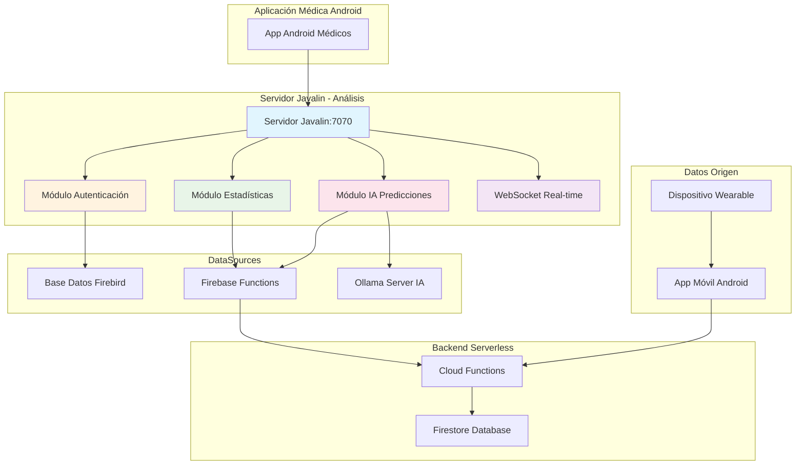
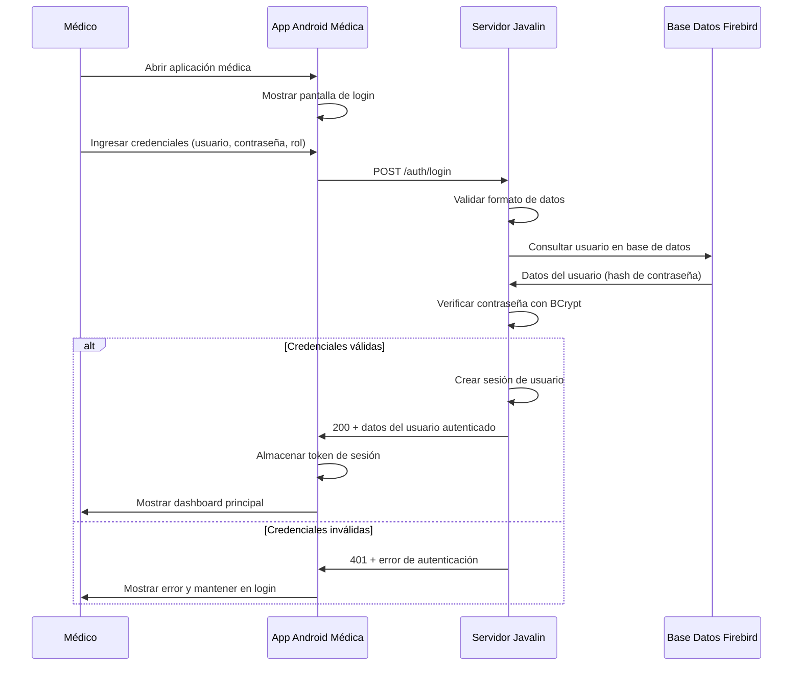
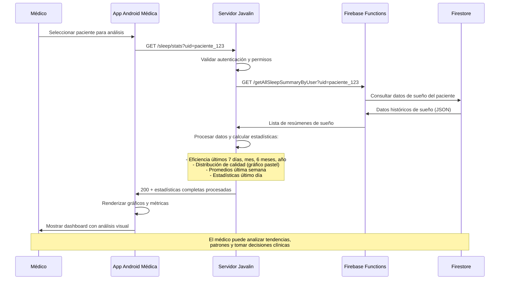
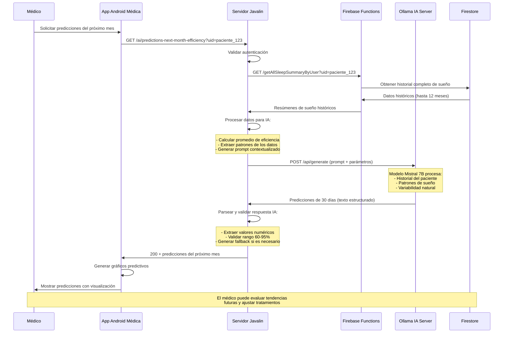
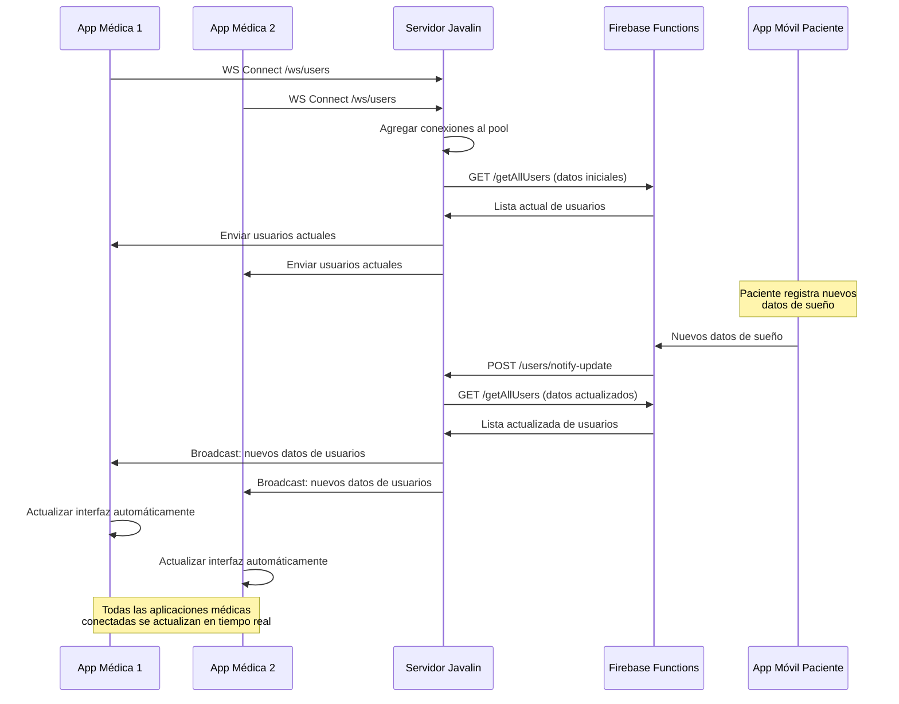

# NOX Sleep Analysis - Servidor de Análisis Médico

## Índice
1. [Introducción](#introducción)
2. [Objetivo General](#objetivo-general)
3. [Objetivos Específicos](#objetivos-específicos)
4. [Arquitectura del Sistema](#arquitectura-del-sistema)
5. [Tecnologías y Dependencias](#tecnologías-y-dependencias)
6. [Configuración del Proyecto](#configuración-del-proyecto)
7. [Estructura del Proyecto](#estructura-del-proyecto)
8. [DataSources y Conexiones](#datasources-y-conexiones)
9. [Funcionalidades Principales](#funcionalidades-principales)
10. [Endpoints de la API](#endpoints-de-la-api)
11. [Flujos de Uso](#flujos-de-uso)
12. [Configuración Docker](#configuración-docker)
13. [Despliegue](#despliegue)
14. [Monitoreo y Logging](#monitoreo-y-logging)
15. [Solución de Problemas](#solución-de-problemas)
16. [Créditos](#créditos)

---

## Introducción

**`sleep-analysis-dreamapp-api`** es el servidor de análisis médico del sistema **NOX** de **XIADANOS Corporation S.A.**, construido con Javalin (framework web para Kotlin/Java). Este módulo actúa como la capa de inteligencia y análisis que procesa los datos de sueño almacenados en Firebase Functions para generar estadísticas avanzadas, predicciones con IA y proporcionar autenticación segura para médicos especialistas.

El servidor implementa una arquitectura Clean Architecture con tres componentes principales: autenticación de usuarios médicos mediante base de datos Firebird, generación de estadísticas a partir de datos obtenidos del backend serverless, y predicciones inteligentes utilizando modelos de IA local mediante Ollama.

## Objetivo General

Desarrollar e implementar un servidor de análisis médico robusto y escalable que permita a profesionales de la salud acceder de forma segura a análisis avanzados de datos de sueño, incluyendo estadísticas detalladas, tendencias temporales y predicciones basadas en inteligencia artificial para mejorar el diagnóstico y tratamiento de trastornos del sueño.

## Objetivos Específicos

- **Implementar autenticación segura** para médicos especialistas usando base de datos Firebird con encriptación BCrypt
- **Generar estadísticas avanzadas** de sueño procesando datos del backend serverless de Firebase Functions
- **Proporcionar predicciones inteligentes** del próximo mes utilizando modelos de IA local (Ollama con Mistral 7B)
- **Facilitar acceso en tiempo real** a datos de pacientes mediante WebSockets para actualizaciones automáticas
- **Garantizar escalabilidad y rendimiento** mediante connection pooling y arquitectura asíncrona
- **Ofrecer API RESTful completa** para integración con aplicaciones Android médicas especializadas
- **Implementar logging detallado** para auditoría y monitoreo del sistema en entornos de producción

## Arquitectura del Sistema



### Componentes Principales

1. **Servidor Javalin**: Framework web ligero que maneja todas las peticiones HTTP y WebSocket
2. **Módulo de Autenticación**: Gestiona login/logout seguro de médicos con base de datos Firebird
3. **Módulo de Estadísticas**: Procesa y analiza datos de sueño obtenidos de Firebase Functions
4. **Módulo de IA**: Genera predicciones usando modelos de lenguaje local (Ollama + Mistral 7B)
5. **WebSocket Real-time**: Actualización automática de datos para aplicaciones conectadas

### Flujo de Datos Principal

1. **Recolección**: Dispositivo wearable → App móvil → Firebase Functions → Firestore
2. **Solicitud**: App médica Android → Servidor Javalin (autenticación)
3. **Procesamiento**: Servidor obtiene datos de Firebase Functions
4. **Análisis**: Generación de estadísticas y métricas avanzadas
5. **Predicción**: IA local genera predicciones del próximo mes
6. **Respuesta**: Datos procesados → App médica Android
7. **Actualización**: WebSocket notifica cambios en tiempo real

## Tecnologías y Dependencias

### Framework Principal
- **Javalin 6.3.0**: Framework web ligero y moderno para Kotlin/Java
- **Kotlin 2.1.21**: Lenguaje de programación principal con soporte completo de corrutinas
- **JVM 21**: Máquina virtual Java con optimizaciones de rendimiento

### Base de Datos y Conectividad
- **Firebird 5.0**: Base de datos relacional para autenticación de médicos
- **Jaybird 6.0.2**: Driver JDBC optimizado para Firebird
- **HikariCP 6.3.0**: Pool de conexiones de alto rendimiento
- **KotliQuery 1.9.1**: DSL para consultas SQL en Kotlin

### Procesamiento y Serialización
- **Jackson 2.17.1**: Serialización/deserialización JSON con módulo Kotlin
- **Jackson JSR310**: Soporte para tipos de fecha y hora de Java 8+
- **OkHttp 5.1.0**: Cliente HTTP asíncrono para comunicación con servicios externos

### Seguridad y Autenticación
- **jBCrypt 0.4.3**: Encriptación segura de contraseñas con algoritmo BCrypt
- **Firebase Admin 9.2.0**: SDK para autenticación y acceso a Firestore
- **Google Cloud Firestore 3.17.1**: Cliente directo para base de datos NoSQL

### Logging y Monitoreo
- **SLF4J 2.0.13**: API de logging estándar para Java
- **Logback 1.4.14**: Implementación de logging con configuración avanzada
- **Kotlin Coroutines 1.9.0**: Programación asíncrona y concurrente

### Construcción y Empaquetado
- **Gradle 8.x**: Sistema de construcción con soporte Kotlin DSL
- **Shadow Plugin 8.1.1**: Generación de JAR ejecutable con todas las dependencias

## Configuración del Proyecto

### Configuración Local (server.properties)

```properties
# Configuración Base de Datos Firebird (Autenticación)
database.jdbc.protocol=jdbc:firebird
database.host=localhost
database.port=3051
database.name=db_dashboard
database.user=sysdba
database.password=<CONFIGURAR_MEDIANTE_VARIABLE_DE_ENTORNO>
database.encoding=UTF8

# Configuración Ollama (Inteligencia Artificial)
ollama.url=http://localhost:11434
ollama.model=mistral:7b

# Configuración Firebase (Datos de Sueño)
firebase.project-id=dream-34ed4
firebase.url-functions=https://us-central1-dream-34ed4.cloudfunctions.net/
# Para desarrollo local usar: http://127.0.0.1:5001/dream-34ed4/us-central1/
firebase.host=localhost:8080
```

### Configuración Docker (server.docker.properties)

```properties
# Configuración Base de Datos Firebird para Docker
database.jdbc.protocol=jdbc:firebird
database.host=firebird5-engine
database.port=3050
database.name=db_dashboard
database.user=sysdba
database.password=<CONFIGURAR_MEDIANTE_VARIABLE_DE_ENTORNO>
database.encoding=UTF8

# Configuración Ollama para Docker
ollama.url=http://ollama:11434
ollama.model=mistral:7b

# Configuración Firebase para Docker
firebase.project-id=dream-34ed4
firebase.url-functions=https://us-central1-dream-34ed4.cloudfunctions.net/
# Para desarrollo con Docker usar: http://host.docker.internal:5001/dream-34ed4/us-central1/
firebase.host=localhost:8080
```

### Variables de Entorno

| Variable | Descripción | Valor por Defecto |
|----------|-------------|-------------------|
| `DB_HOST` | Host de base de datos Firebird | `localhost` |
| `DB_PORT` | Puerto de base de datos | `3051` |
| `DB_NAME` | Nombre de base de datos | `db_dashboard` |
| `DB_USER` | Usuario de base de datos | `sysdba` |
| `DB_PASSWORD` | Contraseña de base de datos | Sin valor predeterminado |
| `OLLAMA_URL` | URL del servidor Ollama | `http://localhost:11434` |
| `FIREBASE_FUNCTIONS_URL` | URL de Firebase Functions | Variable según entorno |

## Estructura del Proyecto

### Organización de Directorios

```
sleep-analysis-dreamapp-api/
├── build.gradle.kts                 # Configuración de construcción
├── settings.gradle.kts              # Configuración del proyecto
├── docker-compose.yml               # Orquestación de contenedores
├── Dockerfile                       # Imagen de contenedor
├── config/
│   ├── server.properties           # Configuración local
│   └── server.docker.properties    # Configuración Docker
├── src/main/kotlin/
│   ├── Main.kt                     # Punto de entrada principal
│   ├── domain/                     # Lógica de negocio
│   │   ├── entity/                 # Entidades del dominio
│   │   │   ├── auth/              # Entidades de autenticación
│   │   │   └── users/             # Entidades de usuarios
│   │   ├── model/                  # Modelos de datos
│   │   ├── repository/             # Interfaces de repositorios
│   │   ├── service/                # Interfaces de servicios
│   │   └── usecase/                # Casos de uso
│   │       ├── auth/              # Casos de uso de autenticación
│   │       ├── sleep/             # Casos de uso de análisis de sueño
│   │       └── users/             # Casos de uso de usuarios
│   ├── infrastructure/             # Capa de infraestructura
│   │   ├── config/                # Configuración del sistema
│   │   ├── datasouce/             # Fuentes de datos
│   │   │   ├── authdatabase/      # DataSource Firebird
│   │   │   └── ollama/            # DataSource Ollama IA
│   │   ├── di/                    # Inyección de dependencias
│   │   ├── dto/                   # Objetos de transferencia de datos
│   │   ├── repository/            # Implementaciones de repositorios
│   │   ├── service/               # Implementaciones de servicios
│   │   └── Util.kt               # Utilidades comunes
│   └── presentation/              # Capa de presentación
│       ├── auth/                  # Gestión de autenticación
│       ├── controller/            # Controladores HTTP
│       │   ├── account/          # Gestión de cuentas
│       │   ├── auth/             # Autenticación
│       │   ├── sleep/            # Análisis de sueño
│       │   └── users/            # Gestión de usuarios
│       └── dto/                   # DTOs de presentación
├── src/main/resources/
│   └── serviceAccountKey.json     # Credenciales Firebase
└── build/                         # Archivos compilados
    └── libs/                      # JAR ejecutable
```

### Arquitectura Clean Architecture

El proyecto sigue los principios de Clean Architecture con separación clara de responsabilidades:

#### **Domain Layer (Dominio)**
- **Entities**: Objetos de negocio fundamentales (User, Role, SleepSummary)
- **Use Cases**: Lógica de negocio específica (LoginUseCase, GetSleepStatsUseCase)
- **Repository Interfaces**: Contratos para acceso a datos
- **Service Interfaces**: Contratos para servicios externos

#### **Infrastructure Layer (Infraestructura)**
- **DataSources**: Conexiones a bases de datos y servicios externos
- **Repository Implementations**: Implementaciones concretas de repositorios
- **Service Implementations**: Implementaciones de servicios
- **Configuration**: Gestión de configuración del sistema

#### **Presentation Layer (Presentación)**
- **Controllers**: Manejo de peticiones HTTP y respuestas
- **DTOs**: Objetos para transferencia de datos
- **Authentication**: Gestión de sesiones y autorización
- **WebSocket Handlers**: Manejo de conexiones en tiempo real

## DataSources y Conexiones

### 1. AuthDataSource (Base de Datos Firebird)

**Propósito**: Gestión de autenticación y autorización de médicos especialistas

**Configuración**:
```kotlin
object AuthDataSource {
    private lateinit var dataSource: HikariDataSource
    
    fun init() {
        val config = HikariConfig().apply {
            jdbcUrl = Config.SVR_AUTH_CONF.dbURL
            username = Config.SVR_AUTH_CONF.dbUser
            password = Config.SVR_AUTH_CONF.dbPwd
            maximumPoolSize = 10
            isAutoCommit = true
            transactionIsolation = "TRANSACTION_REPEATABLE_READ"
        }
        dataSource = HikariDataSource(config)
    }
}
```

**Características**:
- **Connection Pooling**: HikariCP para alto rendimiento
- **Pool Size**: Máximo 10 conexiones concurrentes
- **Auto Commit**: Habilitado para operaciones simples
- **Isolation Level**: REPEATABLE_READ para consistencia

**Esquema de Base de Datos**:
```sql
-- Tabla de usuarios médicos
CREATE TABLE user_accounts (
    id VARCHAR(36) PRIMARY KEY,
    username VARCHAR(100) UNIQUE NOT NULL,
    password_hash VARCHAR(60) NOT NULL,
    role VARCHAR(20) NOT NULL,
    active BOOLEAN DEFAULT TRUE,
    created_at TIMESTAMP DEFAULT CURRENT_TIMESTAMP,
    updated_at TIMESTAMP DEFAULT CURRENT_TIMESTAMP
);

-- Índices para optimización
CREATE INDEX idx_username ON user_accounts (username);
CREATE INDEX idx_role ON user_accounts (role);
CREATE INDEX idx_active ON user_accounts (active);
```

### 2. OllamaDataSource (Servidor de IA)

**Propósito**: Conexión con servidor Ollama para generación de predicciones con IA

**Configuración**:
```kotlin
class OllamaDataSource {
    private val client = OkHttpClient.Builder()
        .connectTimeout(100, TimeUnit.SECONDS)
        .readTimeout(1000, TimeUnit.SECONDS)
        .writeTimeout(1000, TimeUnit.SECONDS)
        .build()
    
    private val ollamaBaseUrl = Config.SVR_OLLAMA_CONF.ollamaServerURL
    private val modelName = Config.SVR_OLLAMA_CONF.ollamaNameModel
}
```

**Características**:
- **Modelo**: Mistral 7B optimizado para análisis médico
- **Timeouts**: Configurados para operaciones de larga duración
- **Health Check**: Verificación automática de disponibilidad
- **Streaming**: Soporte para respuestas en tiempo real

**Métodos Principales**:
```kotlin
// Generar texto con parámetros configurables
fun generateText(
    prompt: String,
    temperature: Double = 0.7,
    topP: Double = 0.9,
    maxTokens: Int = 1000
): String?

// Generar texto en streaming
fun generateTextStream(
    prompt: String,
    onChunk: (chunk: String?, finished: Boolean) -> Unit
)

// Verificar salud de conexión
fun isConnectionHealthy(): Boolean
```

### 3. Firebase Functions DataSource

**Propósito**: Conexión con backend serverless para obtener datos de sueño

**Configuración**:
```kotlin
object RepositoryProvider {
    private val httpClient: HttpClient = HttpClient.newBuilder().build()
    private val baseURL: String = Config.SVR_FIRESTORE_CONF.firestoreFunctionsURL
    
    val sleepRepository: SleepRepository = SleepRepositoryImpl(httpClient, baseURL)
    val userRepository: UserRepository = UserRepositoryImpl(httpClient, baseURL)
}
```

**Endpoints Consumidos**:
- `getAllSleepSummaryByUser?uid={userId}`: Obtener datos de sueño por usuario
- `getAllUsers`: Obtener lista completa de usuarios registrados

**Características**:
- **HTTP Client**: Cliente HTTP Java nativo optimizado
- **Connection Reuse**: Reutilización de conexiones TCP
- **JSON Processing**: Jackson para serialización/deserialización
- **Error Handling**: Manejo robusto de errores de red

### Inicialización y Validación de DataSources

```kotlin
fun main() {
    val logger = LoggerFactory.getLogger("Main")

    // Validación de base de datos de autenticación
    if (!validateDataSource(
        "Authentication database", 
        { AuthDataSource.init() }, 
        { AuthDataSource.isConnectionHealthy() }
    )) return

    // Validación de servidor Ollama
    val ollamaDataSource = OllamaDataSource()
    if (!validateDataSource(
        "Ollama server", 
        { ollamaDataSource.init() }, 
        { ollamaDataSource.isConnectionHealthy() }
    )) return

    // Inicialización del servidor Javalin
    val app = Javalin.create { config ->
        // Configuración del servidor
    }.start("0.0.0.0", 7070)
}
```

## Funcionalidades Principales

### 1. Autenticación de Médicos Especialistas

**Objetivo**: Proporcionar acceso seguro y controlado a datos médicos sensibles

**Características**:
- **Encriptación BCrypt**: Hashing seguro de contraseñas con salt automático
- **Gestión de Sesiones**: Control de sesiones con timeout automático
- **Roles de Usuario**: SYSADMIN, ADMIN, CLIENT con permisos diferenciados
- **Validación de Credenciales**: Verificación robusta contra base de datos Firebird

#### **Flujo de Autenticación - Arquitectura Clean**

##### **1. Presentation Layer (Capa de Presentación)**

**AuthController.kt** - Controlador HTTP para autenticación
```kotlin
// AQUÍ VA LA CLASE AuthController
// Recibe peticiones HTTP POST /auth/login y /auth/logout
// Valida formato de datos de entrada
// Llama a los casos de uso correspondientes
// Retorna respuestas HTTP con formato JSON
```

**LoginRequestDto.kt** - DTO para datos de login
```kotlin
// AQUÍ VA LA CLASE LoginRequestDto
// Data class con userName, password, role
// Validaciones básicas de formato
```

**AccessManager.kt** - Gestor de acceso y autorización
```kotlin
// AQUÍ VA LA CLASE AccessManager
// Middleware de autenticación para endpoints
// Validación de permisos por roles
// Gestión de sesiones de usuario
```

##### **2. Domain Layer (Capa de Dominio)**

**LoginUseCase.kt** - Caso de uso para login
```kotlin
// AQUÍ VA LA CLASE LoginUseCase
// Lógica de negocio para autenticación
// Coordinación entre AuthService y gestión de sesiones
// Validación de reglas de negocio (usuario activo, rol válido)
```

**LogoutUseCase.kt** - Caso de uso para logout
```kotlin
// AQUÍ VA LA CLASE LogoutUseCase
// Limpieza de sesión de usuario
// Invalidación de tokens de acceso
```

**UserInfo.kt** - Entidad de información de usuario
```kotlin
// AQUÍ VA LA CLASE UserInfo
// Entidad del dominio con datos del usuario autenticado
// Propiedades: id, username, role, active
```

**Role.kt** - Enum de roles del sistema
```kotlin
// AQUÍ VA EL ENUM Role
// SYSADMIN, ADMIN, CLIENT, UNAUTHENTICATED
// Implementa RouteRole de Javalin
```

**AuthService.kt** - Interface del servicio de autenticación
```kotlin
// AQUÍ VA LA INTERFACE AuthService
// Contratos para autenticación y autorización
// Métodos: authenticate, createSession, destroySession
```

##### **3. Infrastructure Layer (Capa de Infraestructura)**

**AuthServiceImpl.kt** - Implementación del servicio de autenticación
```kotlin
// AQUÍ VA LA CLASE AuthServiceImpl
// Implementación concreta de AuthService
// Uso de AuthDataSource para acceso a datos
// Lógica de encriptación BCrypt
```

**UserAccountRepositoryImpl.kt** - Repositorio de cuentas de usuario
```kotlin
// AQUÍ VA LA CLASE UserAccountRepositoryImpl
// Implementación de acceso a base de datos Firebird
// Consultas SQL para validación de credenciales
// Uso de KotliQuery para operaciones de BD
```

**AuthDataSource.kt** - DataSource de base de datos de autenticación
```kotlin
// AQUÍ VA LA CLASE AuthDataSource
// Configuración de HikariCP para Firebird
// Pool de conexiones optimizado
// Health checks de conectividad
```

#### **Flujo Paso a Paso - Autenticación**

**Paso 1: Recepción de Petición**
- `AuthController.login()` recibe POST /auth/login
- Valida que `LoginRequestDto` tenga todos los campos requeridos
- Verifica formato básico de userName, password, role

**Paso 2: Validación de Dominio**
- `LoginUseCase.execute()` aplica reglas de negocio
- Verifica que el rol solicitado sea válido
- Coordina la autenticación con `AuthService`

**Paso 3: Verificación de Credenciales**
- `AuthServiceImpl.authenticate()` consulta base de datos
- `UserAccountRepositoryImpl` ejecuta query SQL en Firebird
- Compara hash BCrypt de contraseña ingresada vs almacenada

**Paso 4: Gestión de Sesión**
- Si credenciales válidas: crea sesión en `Context` de Javalin
- Almacena `UserInfo` en sesión con rol y permisos
- `AccessManager` gestiona autorización para endpoints subsecuentes

**Paso 5: Respuesta al Cliente**
- Retorna `UserInfo` serializado en JSON si éxito
- Retorna error 401 con mensaje descriptivo si falla
- Cliente almacena información de sesión para peticiones futuras

### 2. Generación de Estadísticas Avanzadas

**Objetivo**: Procesar y analizar datos de sueño para generar insights médicos

#### **Flujo de Estadísticas - Arquitectura Clean**

##### **1. Presentation Layer (Capa de Presentación)**

**SleepStatsController.kt** - Controlador de estadísticas de sueño
```kotlin
// AQUÍ VA LA CLASE SleepStatsController
// Recibe peticiones GET /sleep/stats?uid={userId}
// Valida parámetro uid obligatorio
// Llama a GetSleepStatsUseCase
// Retorna respuesta con estadísticas procesadas
```

##### **2. Domain Layer (Capa de Dominio)**

**GetSleepStatsUseCase.kt** - Caso de uso principal de estadísticas
```kotlin
// AQUÍ VA LA CLASE GetSleepStatsUseCase
// Lógica de negocio para generar estadísticas
// Coordina obtención de datos con SleepRepository
// Aplica algoritmos de análisis temporal
// Genera métricas agregadas y tendencias
```

**SleepSummary.kt** - Entidad del dominio para resumen de sueño
```kotlin
// AQUÍ VA LA CLASE SleepSummary
// Entidad principal con datos de una sesión de sueño
// Propiedades: date, quality, sleepEfficiency, sleepDuration, etc.
// Métodos de dominio para cálculos de métricas
```

**Quality.kt** - Value Object para calidad de sueño
```kotlin
// AQUÍ VA EL ENUM Quality
// EXCELLENT, GOOD, FAIR, POOR
// Métodos para conversión desde string y validación
```

**SleepRepository.kt** - Interface del repositorio de sueño
```kotlin
// AQUÍ VA LA INTERFACE SleepRepository
// Contrato para acceso a datos de sueño
// Método: getAllSleepSummaryByUser(uidUser: String)
```

##### **3. Infrastructure Layer (Capa de Infraestructura)**

**SleepRepositoryImpl.kt** - Implementación del repositorio
```kotlin
// AQUÍ VA LA CLASE SleepRepositoryImpl
// Implementación que consume Firebase Functions
// HttpClient para comunicación con backend serverless
// Mapeo de SleepSummaryDto a SleepSummary (domain)
```

**SleepStatsResponse.kt** - DTO de respuesta de estadísticas
```kotlin
// AQUÍ VA LA CLASE SleepStatsResponse
// Data class con estructura completa de respuesta
// efficiencyChart, qualityPie, averagesLast7Days, lastDayStats
```

**SleepEfficiencyChartResponse.kt** - DTO para gráficos de eficiencia
```kotlin
// AQUÍ VA LA CLASE SleepEfficiencyChartResponse
// Data class con arrays para gráficos temporales
// last7Days, lastMonth, last6Months, lastYear
```

**SleepEfficiencyPointDto.kt** - DTO para puntos del gráfico
```kotlin
// AQUÍ VA LA CLASE SleepEfficiencyPointDto
// Data class con date y sleepEfficiency
// Representa un punto en gráfico temporal
```

**QualityPieStatsResponse.kt** - DTO para gráfico de pastel
```kotlin
// AQUÍ VA LA CLASE QualityPieStatsResponse
// Data class con Map<Quality, Count> para último mes
// Distribución de calidad de sueño
```

**SleepAveragesDto.kt** - DTO para promedios calculados
```kotlin
// AQUÍ VA LA CLASE SleepAveragesDto
// Data class con todas las métricas promediadas
// sleepEfficiency, sleepDuration, light, deep, rem, etc.
```

#### **Flujo Paso a Paso - Estadísticas**

**Paso 1: Recepción y Validación**
- `SleepStatsController.getSleepStats()` recibe GET con parámetro uid
- Valida que uid no sea null o vacío
- Verifica autenticación del médico solicitante

**Paso 2: Coordinación de Dominio**
- `GetSleepStatsUseCase.execute(uidUser)` inicia procesamiento
- Define rangos temporales: últimos 7 días, mes, 6 meses, año
- Establece fecha actual como referencia para cálculos

**Paso 3: Obtención de Datos**
- `SleepRepositoryImpl.getAllSleepSummaryByUser()` consume Firebase Functions
- Realiza petición HTTP a `/getAllSleepSummaryByUser?uid={uidUser}`
- Mapea JSON response a lista de `SleepSummary` (domain entities)

**Paso 4: Procesamiento Temporal**
- Filtra datos por rangos temporales definidos
- **Últimos 7 días**: Array de puntos diarios para gráfico de líneas
- **Último mes**: Tendencia diaria detallada
- **Últimos 6 meses**: Promedios mensuales agregados
- **Último año**: Vista anual con promedios por mes

**Paso 5: Análisis de Calidad**
- Agrupa datos del último mes por valor de calidad
- Cuenta frecuencia de cada nivel de calidad
- Genera datos para gráfico de pastel (quality distribution)

**Paso 6: Cálculo de Promedios**
- **Última semana**: Promedio de todas las métricas de los últimos 7 días
- **Último día**: Datos más recientes disponibles del usuario
- Aplica funciones de agregación (average, sum) según métrica

**Paso 7: Ensamblaje de Respuesta**
- Construye `SleepStatsResponse` con todas las estadísticas calculadas
- Estructura datos para consumo directo por frontend
- Retorna JSON formateado con métricas listas para gráficos

#### **Eficiencia de Sueño Temporal**
- **Últimos 7 días**: Gráfico de líneas con eficiencia diaria
- **Último mes**: Tendencia mensual detallada
- **Últimos 6 meses**: Promedios mensuales agregados
- **Último año**: Vista anual para análisis de largo plazo

#### **Estadísticas de Calidad**
- **Distribución de Calidad**: Gráfico de pastel del último mes
- **Categorías**: Excelente (90-100%), Buena (75-89%), Regular (60-74%), Pobre (<60%)

#### **Promedios de la Última Semana**
```kotlin
data class SleepAveragesDto(
    val sleepEfficiency: Int,    // Porcentaje de eficiencia
    val sleepDuration: Int,      // Duración total en minutos
    val light: Int,              // Sueño ligero en minutos
    val deep: Int,               // Sueño profundo en minutos
    val rem: Int,                // Sueño REM en minutos
    val awake: Int,              // Tiempo despierto en minutos
    val avgHR: Int,              // Frecuencia cardíaca promedio
    val awakenings: Int          // Número total de despertares
)
```

#### **Estadísticas del Último Día**
- Datos más recientes disponibles del usuario
- Métricas detalladas de la sesión de sueño más reciente

### 3. Predicciones con Inteligencia Artificial

**Objetivo**: Generar predicciones del próximo mes usando modelos de IA local

#### **Flujo de Predicciones IA - Arquitectura Clean**

##### **1. Presentation Layer (Capa de Presentación)**

**SleepAiController.kt** - Controlador de inteligencia artificial
```kotlin
// AQUÍ VA LA CLASE SleepAiController
// Recibe peticiones GET /ai/predictions-next-month-efficiency?uid={userId}
// Valida parámetro uid obligatorio
// Llama a GeneratePredictionsEfficiencyNextMonth UseCase
// Retorna respuesta con predicciones de 30 días
```

##### **2. Domain Layer (Capa de Dominio)**

**GeneratePredictionsEfficiencyNextMonth.kt** - Caso de uso principal de predicciones
```kotlin
// AQUÍ VA LA CLASE GeneratePredictionsEfficiencyNextMonth
// Lógica de negocio para generar predicciones con IA
// Coordina obtención de datos históricos
// Construye prompt contextualizado para IA
// Procesa respuesta de Ollama y valida predicciones
```

**GetSleepRecommendationUseCase.kt** - Caso de uso para recomendaciones
```kotlin
// AQUÍ VA LA CLASE GetSleepRecommendationUseCase
// Genera recomendaciones personalizadas basadas en historial
// Analiza patrones de sueño y tendencias
// Construye prompt médico para IA
```

**SleepEfficiencyPredictionDto.kt** - DTO para predicciones
```kotlin
// AQUÍ VA LA CLASE SleepEfficiencyPredictionDto
// Data class con date y sleepEfficiency predicha
// Representa una predicción de un día específico
```

##### **3. Infrastructure Layer (Capa de Infraestructura)**

**OllamaDataSource.kt** - DataSource del servidor de IA
```kotlin
// AQUÍ VA LA CLASE OllamaDataSource
// Configuración de conexión con servidor Ollama
// Cliente HTTP con timeouts optimizados para IA
// Métodos para generación de texto y streaming
// Health checks de disponibilidad del modelo
```

#### **Flujo Paso a Paso - Predicciones IA**

**Paso 1: Recepción y Validación**
- `SleepAiController.predictEfficiencyNextMonth()` recibe GET con uid
- Valida que uid sea válido y no nulo
- Verifica autenticación del médico solicitante

**Paso 2: Inicialización del Caso de Uso**
- `GeneratePredictionsEfficiencyNextMonth.execute(uidUser)` inicia proceso
- Establece fechas: hoy como referencia, próximos 30 días como objetivo
- Inicializa componentes de IA y validación

**Paso 3: Obtención de Datos Históricos**
- Usa `SleepRepositoryImpl` para obtener historial completo del usuario
- Consulta todos los datos disponibles de sueño desde Firebase
- Calcula promedio histórico de eficiencia como baseline

**Paso 4: Construcción del Prompt Médico**
- Construye prompt contextualizado con:
  - Historial completo de eficiencia de sueño
  - Promedio histórico calculado
  - Parámetros específicos para predicciones médicas
  - Restricciones de realismo (60-95% eficiencia)

**Paso 5: Comunicación con IA**
- `OllamaDataSource.generateText()` envía prompt a Mistral 7B
- Configura parámetros de generación:
  - Temperature: 0.4 (consistencia moderada)
  - Top-P: 0.9 (diversidad controlada)
  - Max tokens: 1000 (respuesta completa)

**Paso 6: Procesamiento de Respuesta IA**
- Parsea respuesta de texto a valores numéricos
- Extrae secuencia de 30 valores de eficiencia
- Valida que valores estén en rango válido (0-100%)
- Aplica coerción para mantener rangos realistas

**Paso 7: Validación y Fallback**
- Verifica que se obtuvieron al menos 25 predicciones válidas
- Si IA falla: activa sistema de fallback determinístico
- Fallback usa variaciones aleatorias sobre promedio histórico
- Garantiza siempre 30 días de predicciones

**Paso 8: Construcción de Respuesta**
- Mapea valores predichos a fechas específicas (próximos 30 días)
- Construye array de `SleepEfficiencyPredictionDto`
- Retorna JSON con predicciones listas para visualización
- Incluye metadata de éxito y origen de datos (IA vs fallback)

#### **Componentes Adicionales - Arquitectura Completa**

##### **4. Dependency Injection (Inyección de Dependencias)**

**RepositoryProvider.kt** - Proveedor centralizado de dependencias
```kotlin
// AQUÍ VA EL OBJECT RepositoryProvider
// Singleton que proporciona instancias de repositorios
// Configura HttpClient compartido para Firebase Functions
// Instancia UserRepository y SleepRepository
// Centraliza configuración de URLs y conexiones
```

##### **5. Configuration (Configuración del Sistema)**

**Config.kt** - Configuración centralizada
```kotlin
// AQUÍ VA EL OBJECT Config
// Carga propiedades desde server.properties
// Define ServerAuthConfig, ServerOllamaConfig, ServerFirestoreConfig
// Construye URLs de conexión dinámicamente
// Gestiona configuración por ambiente (dev/prod)
```

##### **6. Utilities (Utilidades Compartidas)**

**Util.kt** - Utilidades comunes del sistema
```kotlin
// AQUÍ VA EL OBJECT Util
// Funciones de validación de DataSources
// Utilidades de encriptación BCrypt
// Helpers para formateo de fechas y timestamps
// Mapeo entre objetos y Map<String, Any?>
```

#### **Flujos de Integración entre Módulos**

##### **Flujo Completo: Médico → Estadísticas → Predicciones**

**Paso 1: Autenticación Inicial**
- Médico se autentica via `AuthController.login()`
- `AccessManager` valida sesión en todas las peticiones subsecuentes
- Contexto de sesión mantiene información del médico autenticado

**Paso 2: Selección de Paciente**
- Médico consulta lista de pacientes via `UserController.getAllUsers()`
- `UserRepositoryImpl` obtiene datos de Firebase Functions
- WebSocket notifica actualizaciones automáticas de nuevos pacientes

**Paso 3: Análisis de Estadísticas**
- Médico solicita estadísticas via `SleepStatsController.getSleepStats()`
- `GetSleepStatsUseCase` procesa datos históricos del paciente
- Sistema genera gráficos y métricas para dashboard médico

**Paso 4: Generación de Predicciones**
- Médico solicita predicciones via `SleepAiController.predictEfficiencyNextMonth()`
- `GeneratePredictionsEfficiencyNextMonth` utiliza mismos datos + IA
- Ollama procesa historial y genera predicciones futuras

**Paso 5: Visualización Integrada**
- Frontend médico recibe datos estadísticos + predicciones
- Combina análisis histórico con proyecciones futuras
- Médico toma decisiones basadas en análisis completo

#### **Patrones de Diseño Implementados**

##### **Repository Pattern**
- Abstrae acceso a datos externos (Firebase, Firebird, Ollama)
- Interfaces en Domain, implementaciones en Infrastructure
- Facilita testing y cambio de fuentes de datos

##### **Use Case Pattern**
- Encapsula lógica de negocio específica
- Un caso de uso por funcionalidad principal
- Coordina entre repositorios y servicios

##### **Dependency Injection**
- RepositoryProvider centraliza creación de instancias
- Facilita intercambio de implementaciones
- Reduce acoplamiento entre capas

##### **DTO Pattern**
- Separación entre entidades de dominio y DTOs de presentación
- Mapeo explícito entre capas
- Control de qué datos se exponen externamente

##### **DataSource Pattern**
- Encapsula configuración y gestión de conexiones
- Health checks automáticos
- Configuración centralizada por tipo de fuente

**Modelo Utilizado**:
- **Mistral 7B**: Modelo de lenguaje optimizado para análisis médico
- **Parámetros**: Temperature 0.4 para consistencia, Top-P 0.9 para diversidad
- **Contexto**: Historial completo de eficiencia de sueño del usuario

**Proceso de Predicción**:

```kotlin
class GeneratePredictionsEfficiencyNextMonth(
    private val sleepRepository: SleepRepository,
    private val ollamaDataSource: OllamaDataSource
) {
    fun execute(uidUser: String): List<SleepEfficiencyPredictionDto> {
        // 1. Obtener historial completo del usuario
        val summaries = sleepRepository.getAllSleepSummaryByUser(uidUser)
        
        // 2. Calcular promedio histórico
        val avgEfficiency = summaries.map { it.sleepEfficiency }.average()
        
        // 3. Generar prompt contextualizado
        val prompt = """
            Based on this person's sleep efficiency history (average: ${avgEfficiency}%), 
            predict 30 realistic sleep efficiency values for the next 30 days.
            
            Requirements:
            - Values should be realistic percentages between 60-95%
            - Include natural daily variations
            - Consider weekday/weekend patterns
            - Maintain consistency with historical average
        """.trimIndent()
        
        // 4. Solicitar predicción a la IA
        val response = ollamaDataSource.generateText(prompt, temperature = 0.4)
        
        // 5. Procesar y validar respuesta
        return parseAndValidatePredictions(response)
    }
}
```

**Características de las Predicciones**:
- **Duración**: 30 días exactos desde mañana
- **Variabilidad Natural**: Incluye variaciones realistas día a día
- **Patrones**: Considera diferencias entre días laborables y fines de semana
- **Consistencia**: Mantiene coherencia con el historial del usuario
- **Fallback**: Sistema de respaldo con algoritmos determinísticos

## Endpoints de la API

### Autenticación

#### `POST /auth/login`
**Objetivo**: Autenticar médico y crear sesión segura

**Request Body**:
```json
{
  "userName": "medico01",
  "password": "contraseña_segura",
  "role": "ADMIN"
}
```

**Response Success (200)**:
```json
{
  "success": true,
  "data": {
    "id": "uuid-123",
    "username": "medico01",
    "role": "ADMIN",
    "active": true
  }
}
```

**Response Error (401)**:
```json
{
  "success": false,
  "error": "Invalid credentials"
}
```

#### `POST /auth/logout`
**Objetivo**: Cerrar sesión y limpiar datos de sesión

**Response**:
```json
{
  "success": true
}
```

### Gestión de Usuarios Firebase

#### `GET /users`
**Objetivo**: Obtener lista completa de usuarios registrados en el sistema

**Response**:
```json
[
  {
    "id": "firebase_uid_123",
    "name": "Juan Pérez",
    "weight": 70.5,
    "height": 175,
    "age": 28,
    "sex": "M",
    "pictureUrl": "https://lh3.googleusercontent.com/..."
  }
]
```

#### `POST /users/notify-update`
**Objetivo**: Notificar actualización de usuarios via WebSocket

**Response**:
```json
{
  "message": "User update notification sent"
}
```

### Estadísticas de Sueño

#### `GET /sleep/stats?uid={userId}`
**Objetivo**: Obtener estadísticas completas de sueño para un usuario específico

**Parameters**:
- `uid` (query): UID de Firebase del usuario

**Response**:
```json
{
  "success": true,
  "data": {
    "efficiencyChart": {
      "last7Days": [
        {
          "date": "2024-08-07",
          "sleepEfficiency": 85.2
        }
      ],
      "lastMonth": [...],
      "last6Months": [
        {
          "date": "2024-08",
          "sleepEfficiency": 82.5
        }
      ],
      "lastYear": [...]
    },
    "qualityPie": {
      "lastMonth": {
        "85": 12,  // 12 días con calidad 85%
        "78": 8,   // 8 días con calidad 78%
        "92": 10   // 10 días con calidad 92%
      }
    },
    "averagesLast7Days": {
      "sleepEfficiency": 85,
      "sleepDuration": 420,
      "light": 200,
      "deep": 120,
      "rem": 80,
      "awake": 20,
      "avgHR": 60,
      "awakenings": 2
    },
    "lastDayStats": {
      "sleepEfficiency": 88,
      "sleepDuration": 440,
      "light": 210,
      "deep": 130,
      "rem": 85,
      "awake": 15,
      "avgHR": 58,
      "awakenings": 1
    }
  }
}
```

### Inteligencia Artificial

#### `GET /ai/recommendation?uid={userId}`
**Objetivo**: Generar recomendación personalizada basada en historial de sueño

**Parameters**:
- `uid` (query): UID de Firebase del usuario

**Response**:
```json
{
  "success": true,
  "recommendation": "Basado en tu historial de sueño, se recomienda mantener una rutina constante de 7-8 horas. Tu eficiencia ha mejorado un 15% en las últimas 4 semanas. Considera reducir la exposición a pantallas 2 horas antes de dormir para optimizar el sueño profundo.",
  "keyMetrics": {
    "avgEfficiency": 85.2,
    "trend": "improving",
    "lastWeekAvg": 87.1
  }
}
```

#### `GET /ai/predictions-next-month-efficiency?uid={userId}`
**Objetivo**: Generar predicciones de eficiencia para los próximos 30 días

**Parameters**:
- `uid` (query): UID de Firebase del usuario

**Response**:
```json
{
  "success": true,
  "nextMonthPredictions": [
    {
      "date": "2024-08-14",
      "sleepEfficiency": 84.5
    },
    {
      "date": "2024-08-15",
      "sleepEfficiency": 86.2
    },
    // ... 28 días más
    {
      "date": "2024-09-12",
      "sleepEfficiency": 88.1
    }
  ]
}
```

### Gestión de Cuentas (CRUD)

#### `GET /account`
**Objetivo**: Obtener todas las cuentas de médicos registradas

**Response**:
```json
[
  {
    "id": "uuid-123",
    "username": "medico01",
    "role": "ADMIN",
    "active": true,
    "createdAt": "2024-08-01T10:00:00Z"
  }
]
```

#### `POST /account`
**Objetivo**: Crear nueva cuenta de médico

**Request Body**:
```json
{
  "username": "nuevo_medico",
  "password": "contraseña_segura",
  "role": "CLIENT"
}
```

#### `GET /account/{id}`
**Objetivo**: Obtener información específica de una cuenta

#### `PATCH /account/{id}`
**Objetivo**: Actualizar información de cuenta existente

#### `DELETE /account/{id}`
**Objetivo**: Eliminar cuenta de médico

#### `GET /account/userinfo/{username}`
**Objetivo**: Obtener información detallada por nombre de usuario

### WebSocket Real-time

#### `WS /ws/users`
**Objetivo**: Conexión WebSocket para actualizaciones automáticas de usuarios

**Eventos**:
- **onConnect**: Envía lista actual de usuarios al conectarse
- **onUpdate**: Notifica cambios en la lista de usuarios
- **onDisconnect**: Limpia conexión del pool

**Formato de Mensaje**:
```json
[
  {
    "id": "firebase_uid_123",
    "name": "Juan Pérez",
    "weight": 70.5,
    "height": 175,
    "age": 28,
    "sex": "M",
    "pictureUrl": "url_imagen"
  }
]
```

## Flujos de Uso

### 1. Flujo de Autenticación de Médico



### 2. Flujo de Obtención de Estadísticas de Sueño



### 3. Flujo de Generación de Predicciones con IA



### 4. Flujo de Actualización en Tiempo Real (WebSocket)



## Configuración Docker

### Dockerfile

```dockerfile
# Imagen base Java 21
FROM openjdk:21-jdk-slim

# Directorio de trabajo
WORKDIR /app

# Copiar JAR compilado
COPY build/libs/sleep-analysis-dreamapp-api-1.0-SNAPSHOT.jar app.jar

# Copiar archivos de configuración
COPY config/server.docker.properties config/server.properties
COPY src/main/resources/serviceAccountKey.json .

# Exponer puerto
EXPOSE 7070

# Comando de ejecución
CMD ["java", "-jar", "app.jar"]
```

### Docker Compose

```yaml
services:
  javalin-server:
    build: .
    container_name: javalin-app
    ports:
      - "7070:7070"
    networks:
      - noxapp
    environment:
      - DB_HOST=firebird5-engine
      - DB_PORT=3050
      - DB_NAME=db_dashboard
      - DB_USER=sysdba
      - DB_PASSWORD=${DB_PASSWORD}
      - DB_ENCODING=UTF8
      - OLLAMA_URL=http://ollama:11434
      - FIREBASE_FUNCTIONS_URL=http://host.docker.internal:5001/dream-34ed4/us-central1/
    depends_on:
      - firebird5-engine
      - ollama
    healthcheck:
      test: ["CMD", "curl", "-f", "http://localhost:7070/"]
      interval: 30s
      timeout: 10s
      retries: 3

networks:
  noxapp:
    external: true
```

### Configuración de Red Docker

El servidor se conecta a la red externa `noxapp` que debe incluir:

- **firebird5-engine**: Base de datos Firebird para autenticación
- **ollama**: Servidor de IA con modelo Mistral 7B
- **firebase-functions**: Backend serverless (para desarrollo local)

### Variables de Entorno Docker

```bash
# Configuración de base de datos
DB_HOST=firebird5-engine
DB_PORT=3050
DB_NAME=db_dashboard
DB_USER=sysdba
DB_PASSWORD=<tu-contraseña>
DB_ENCODING=UTF8

# Configuración Ollama
OLLAMA_URL=http://ollama:11434

# Configuración Firebase
FIREBASE_FUNCTIONS_URL=http://host.docker.internal:5001/dream-34ed4/us-central1/
```

## Despliegue

### Construcción Local

#### 1. Compilar Proyecto
```bash
# Compilar código Kotlin
./gradlew build

# Generar JAR ejecutable
./gradlew shadowJar
```

#### 2. Ejecutar Localmente
```bash
# Copiar configuración local
cp config/server.properties config/server.properties

# Ejecutar con Java
java -jar build/libs/sleep-analysis-dreamapp-api-1.0-SNAPSHOT.jar
```

#### 3. Verificar Funcionamiento
```bash
# Verificar estado del servidor
curl http://localhost:7070/

# Respuesta esperada:
# {"message":"Server Javalin"}
```

### Construcción con Docker

#### 1. Construir Imagen
```bash
# Construir imagen Docker
docker build -t sleep-analysis-api:latest .

# Verificar imagen creada
docker images | grep sleep-analysis-api
```

#### 2. Ejecutar con Docker Compose
```bash
# Levantar servicios completos
docker-compose up -d

# Verificar contenedores
docker-compose ps

# Ver logs del servidor
docker-compose logs -f javalin-server
```

#### 3. Verificar Salud de Servicios
```bash
# Verificar servidor Javalin
curl http://localhost:7070/

# Verificar conectividad Ollama
curl http://localhost:11434/api/tags

# Verificar base de datos Firebird
docker-compose exec firebird5-engine isql-fb -user sysdba -password <tu-contraseña> localhost:db_dashboard
```

### Despliegue en Producción

#### 1. Configuración de Producción
```properties
# config/server.production.properties
database.host=prod-firebird.company.com
database.port=3050
ollama.url=http://prod-ollama.company.com:11434
firebase.url-functions=https://us-central1-dream-34ed4.cloudfunctions.net/
```

#### 2. Variables de Entorno Seguras
```bash
# Usar secrets para información sensible
export DB_PASS=$(cat /run/secrets/db_password)
export FIREBASE_PROJECT_ID=$(cat /run/secrets/firebase_project)
```

#### 3. Monitoreo de Salud
```yaml
# docker-compose.prod.yml
healthcheck:
  test: ["CMD", "curl", "-f", "http://localhost:7070/"]
  interval: 30s
  timeout: 10s
  retries: 3
  start_period: 40s
```

### Escalabilidad

#### 1. Múltiples Instancias
```yaml
# Escalado horizontal
services:
  javalin-server:
    deploy:
      replicas: 3
      resources:
        limits:
          memory: 1G
          cpus: '0.5'
```

#### 2. Load Balancer
```yaml
# nginx.conf
upstream javalin_backend {
    server javalin-app-1:7070;
    server javalin-app-2:7070;
    server javalin-app-3:7070;
}

server {
    listen 80;
    location / {
        proxy_pass http://javalin_backend;
    }
}
```

## Monitoreo y Logging

### Configuración de Logging

#### Logback Configuration (logback.xml)
```xml
<configuration>
    <appender name="STDOUT" class="ch.qos.logback.core.ConsoleAppender">
        <encoder>
            <pattern>%d{HH:mm:ss.SSS} [%thread] %-5level %logger{36} - %msg%n</pattern>
        </encoder>
    </appender>
    
    <appender name="FILE" class="ch.qos.logback.core.rolling.RollingFileAppender">
        <file>logs/sleep-analysis-api.log</file>
        <rollingPolicy class="ch.qos.logback.core.rolling.TimeBasedRollingPolicy">
            <fileNamePattern>logs/sleep-analysis-api.%d{yyyy-MM-dd}.log</fileNamePattern>
            <maxHistory>30</maxHistory>
        </rollingPolicy>
        <encoder>
            <pattern>%d{yyyy-MM-dd HH:mm:ss.SSS} [%thread] %-5level %logger{36} - %msg%n</pattern>
        </encoder>
    </appender>
    
    <logger name="team.dreamapp.com" level="INFO"/>
    <logger name="io.javalin" level="INFO"/>
    <logger name="com.zaxxer.hikari" level="INFO"/>
    
    <root level="INFO">
        <appender-ref ref="STDOUT"/>
        <appender-ref ref="FILE"/>
    </root>
</configuration>
```

### Métricas de Monitoreo

#### 1. Salud de DataSources
```kotlin
// Endpoint de health check
get("/health") { ctx ->
    val health = mapOf(
        "server" to "running",
        "timestamp" to System.currentTimeMillis(),
        "dataSources" to mapOf(
            "authDatabase" to AuthDataSource.isConnectionHealthy(),
            "ollamaServer" to ollamaDataSource.isConnectionHealthy(),
            "firebaseFunctions" to checkFirebaseFunctionsHealth()
        )
    )
    ctx.json(health)
}
```

#### 2. Métricas de Rendimiento
```kotlin
class PerformanceMetrics {
    companion object {
        private val requestCounter = AtomicLong(0)
        private val responseTimeRecorder = mutableListOf<Long>()
        
        fun recordRequest(responseTime: Long) {
            requestCounter.incrementAndGet()
            responseTimeRecorder.add(responseTime)
        }
        
        fun getMetrics(): Map<String, Any> {
            return mapOf(
                "totalRequests" to requestCounter.get(),
                "averageResponseTime" to responseTimeRecorder.average(),
                "maxResponseTime" to (responseTimeRecorder.maxOrNull() ?: 0)
            )
        }
    }
}
```

#### 3. Logging Estructurado
```kotlin
class StructuredLogger {
    private val logger = LoggerFactory.getLogger(this::class.java)
    
    fun logApiRequest(method: String, path: String, userId: String?, responseTime: Long) {
        val logData = mapOf(
            "event" to "api_request",
            "method" to method,
            "path" to path,
            "userId" to userId,
            "responseTime" to responseTime,
            "timestamp" to Instant.now().toString()
        )
        logger.info("API_REQUEST: ${objectMapper.writeValueAsString(logData)}")
    }
    
    fun logAiPrediction(userId: String, predictionCount: Int, processingTime: Long) {
        val logData = mapOf(
            "event" to "ai_prediction",
            "userId" to userId,
            "predictionCount" to predictionCount,
            "processingTime" to processingTime,
            "timestamp" to Instant.now().toString()
        )
        logger.info("AI_PREDICTION: ${objectMapper.writeValueAsString(logData)}")
    }
}
```

### Alertas y Notificaciones

#### 1. Configuración de Alertas
```kotlin
class AlertManager {
    fun checkSystemHealth() {
        val alerts = mutableListOf<String>()
        
        if (!AuthDataSource.isConnectionHealthy()) {
            alerts.add("CRITICAL: Auth database connection failed")
        }
        
        if (!ollamaDataSource.isConnectionHealthy()) {
            alerts.add("WARNING: Ollama server not responding")
        }
        
        val avgResponseTime = PerformanceMetrics.getAverageResponseTime()
        if (avgResponseTime > 5000) {
            alerts.add("WARNING: High response time detected: ${avgResponseTime}ms")
        }
        
        if (alerts.isNotEmpty()) {
            sendAlerts(alerts)
        }
    }
}
```

## Solución de Problemas

### Errores Comunes de Conexión

#### 1. Error de Conexión a Base de Datos Firebird
**Error**: `Connection refused to firebird5-engine:3050`

**Soluciones**:
```bash
# Verificar que el contenedor Firebird esté ejecutándose
docker-compose ps firebird5-engine

# Verificar configuración de red
docker network ls | grep noxapp

# Probar conectividad directa
telnet firebird5-engine 3050

# Verificar logs de Firebird
docker-compose logs firebird5-engine
```

#### 2. Error de Conexión a Ollama Server
**Error**: `Ollama server is not available at http://ollama:11434`

**Soluciones**:
```bash
# Verificar que Ollama esté ejecutándose
curl http://localhost:11434/api/tags

# Verificar modelo Mistral disponible
curl http://localhost:11434/api/tags | grep mistral

# Descargar modelo si no existe
docker exec ollama-container ollama pull mistral:7b

# Verificar logs de Ollama
docker-compose logs ollama
```

#### 3. Error de Firebase Functions
**Error**: `Firebase functions not responding`

**Soluciones**:
```bash
# Para desarrollo local
firebase emulators:start

# Verificar emulador Functions
curl http://localhost:5001/dream-34ed4/us-central1/getAllUsers

# Para producción verificar URL
curl https://us-central1-dream-34ed4.cloudfunctions.net/getAllUsers
```

### Problemas de Autenticación

#### 1. Error de Credenciales Inválidas
**Error**: `Invalid credentials` en login

**Diagnóstico**:
```sql
-- Verificar usuario en base de datos
SELECT username, role, active FROM user_accounts WHERE username = 'medico01';

-- Verificar hash de contraseña
SELECT password_hash FROM user_accounts WHERE username = 'medico01';
```

**Soluciones**:
```kotlin
// Regenerar hash de contraseña
val newHash = BCrypt.hashpw("nueva_contraseña", BCrypt.gensalt())

// Actualizar en base de datos
UPDATE user_accounts SET password_hash = '$newHash' WHERE username = 'medico01'
```

#### 2. Error de Sesión Expirada
**Error**: `Unauthorized` en endpoints protegidos

**Soluciones**:
```bash
# Verificar configuración de sesiones en Javalin
# Aumentar timeout de sesión si es necesario

# Implementar refresh token para sesiones largas
```

### Problemas de Rendimiento

#### 1. Respuestas Lentas de IA
**Síntoma**: Predicciones tardan más de 30 segundos

**Soluciones**:
```bash
# Verificar recursos de Ollama
docker stats ollama-container

# Aumentar memoria asignada
docker-compose.yml:
  ollama:
    deploy:
      resources:
        limits:
          memory: 4G

# Optimizar prompt para respuestas más rápidas
```

#### 2. Pool de Conexiones Agotado
**Error**: `HikariPool-1 - Connection is not available`

**Soluciones**:
```kotlin
// Aumentar tamaño del pool
val config = HikariConfig().apply {
    maximumPoolSize = 20  // Aumentar de 10 a 20
    minimumIdle = 5
    connectionTimeout = 30000
}
```

### Monitoreo de Problemas

#### 1. Dashboard de Salud del Sistema
```bash
# Endpoint de salud completa
curl http://localhost:7070/health

# Respuesta esperada:
{
  "server": "running",
  "timestamp": 1691915400000,
  "dataSources": {
    "authDatabase": true,
    "ollamaServer": true,
    "firebaseFunctions": true
  },
  "performance": {
    "averageResponseTime": 250,
    "totalRequests": 1500
  }
}
```

#### 2. Logs de Diagnóstico
```bash
# Ver logs en tiempo real
docker-compose logs -f javalin-server

# Filtrar errores específicos
docker-compose logs javalin-server | grep ERROR

# Exportar logs para análisis
docker-compose logs javalin-server > logs/debug-$(date +%Y%m%d).log
```

### Procedimientos de Recuperación

#### 1. Reinicio Completo del Sistema
```bash
# Parar todos los servicios
docker-compose down

# Limpiar volúmenes si es necesario
docker-compose down -v

# Reiniciar con logs
docker-compose up -d && docker-compose logs -f
```

#### 2. Recuperación de Base de Datos
```bash
# Backup de base de datos Firebird
docker exec firebird5-engine gbak -b -user sysdba -password <tu-contraseña> localhost:db_dashboard /backup/db_backup_$(date +%Y%m%d).fbk

# Restaurar desde backup
docker exec firebird5-engine gbak -r -user sysdba -password <tu-contraseña> /backup/db_backup.fbk localhost:db_dashboard_restored
```

## Créditos

### Equipo de Desarrollo

**XIADANOS Corporation S.A.**
- **Proyecto**: Sistema NOX de Monitoreo del Sueño
- **Módulo**: Servidor de Análisis Médico (sleep-analysis-dreamapp-api)
- **Arquitectura**: Clean Architecture con Kotlin + Javalin

### Tecnologías Principales

| Tecnología | Versión | Propósito |
|------------|---------|-----------|
| **Kotlin** | 2.1.21 | Lenguaje de programación principal |
| **Javalin** | 6.3.0 | Framework web ligero |
| **JVM** | 21 | Runtime de ejecución |
| **Firebird** | 5.0 | Base de datos de autenticación |
| **HikariCP** | 6.3.0 | Pool de conexiones |
| **Jackson** | 2.17.1 | Serialización JSON |
| **OkHttp** | 5.1.0 | Cliente HTTP |
| **BCrypt** | 0.4.3 | Encriptación de contraseñas |
| **SLF4J + Logback** | 2.0.13 + 1.4.14 | Sistema de logging |

### Integración del Ecosistema NOX

- **Frontend móvil**: Android (Kotlin/Java) - Recolección de datos
- **Dispositivo IoT**: Wearable con Bluetooth - Sensores biométricos
- **Backend serverless**: Firebase Cloud Functions (TypeScript) - Almacenamiento
- **Base de datos**: Firestore NoSQL - Datos de sueño
- **Análisis médico**: Servidor Javalin (Kotlin) - Estadísticas e IA
- **Interfaz médica**: Android especializada - Dashboard para médicos
- **Inteligencia Artificial**: Ollama + Mistral 7B - Predicciones

### Funcionalidades Implementadas

#### **Autenticación y Seguridad**
- Login/logout seguro con BCrypt
- Gestión de sesiones con timeout
- Control de acceso basado en roles (SYSADMIN, ADMIN, CLIENT)
- Validación de credenciales contra Firebird

#### **Análisis de Datos de Sueño**
- Estadísticas temporales (7 días, mes, 6 meses, año)
- Gráficos de eficiencia de sueño
- Distribución de calidad (gráfico de pastel)
- Promedios y métricas detalladas

#### **Inteligencia Artificial**
- Predicciones del próximo mes usando Mistral 7B
- Recomendaciones personalizadas
- Procesamiento de lenguaje natural médico
- Sistema de fallback para alta disponibilidad

#### **Tiempo Real y Conectividad**
- WebSocket para actualizaciones automáticas
- Integración con Firebase Functions
- API RESTful completa
- Monitoreo de salud de servicios

### Arquitectura y Patrones

- **Clean Architecture**: Separación clara de capas (Domain, Infrastructure, Presentation)
- **Dependency Injection**: Gestión de dependencias con RepositoryProvider
- **Repository Pattern**: Abstracción de acceso a datos
- **Use Case Pattern**: Lógica de negocio encapsulada
- **Connection Pooling**: Optimización de recursos de base de datos

### Licencia y Uso

Este proyecto es propiedad de **XIADANOS Corporation S.A.** y está destinado exclusivamente para el sistema de monitoreo del sueño NOX. El uso, modificación o distribución requiere autorización expresa de la empresa.

**Contacto**: 
- **Empresa**: XIADANOS Corporation S.A.
- **Proyecto**: Sistema NOX - Servidor de Análisis Médico
- **Documentación**: Generada el 13 de agosto de 2025
- **Versión**: 1.0-SNAPSHOT

---

**© 2025 XIADANOS Corporation S.A. - Todos los derechos reservados**
