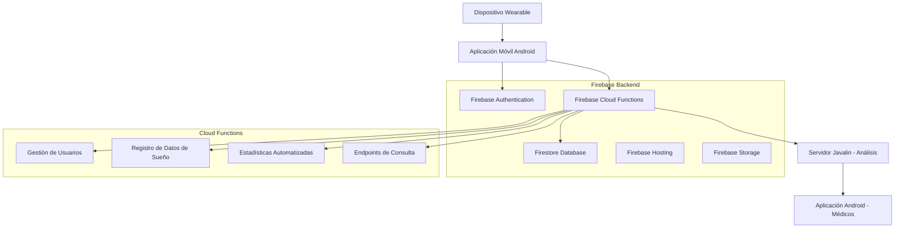
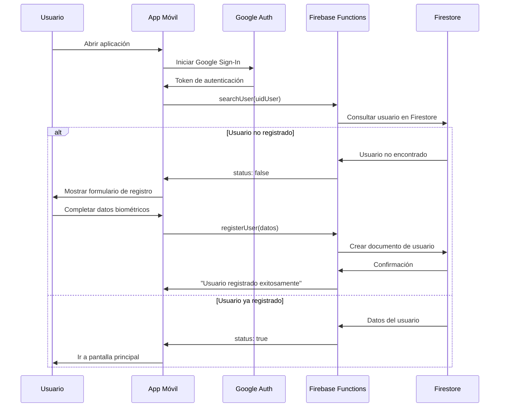
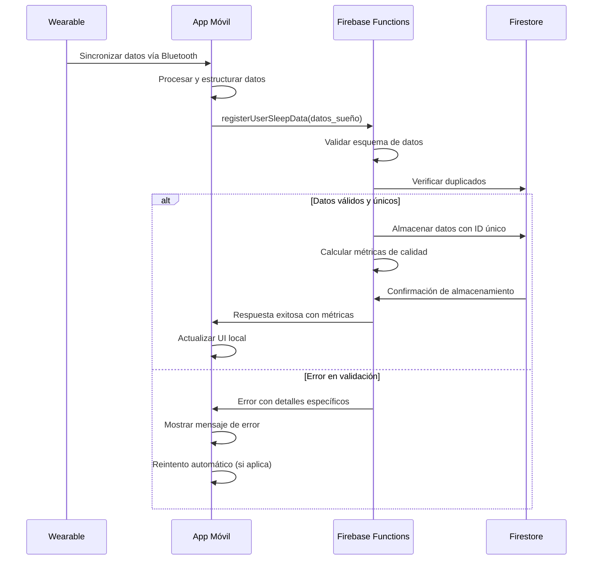
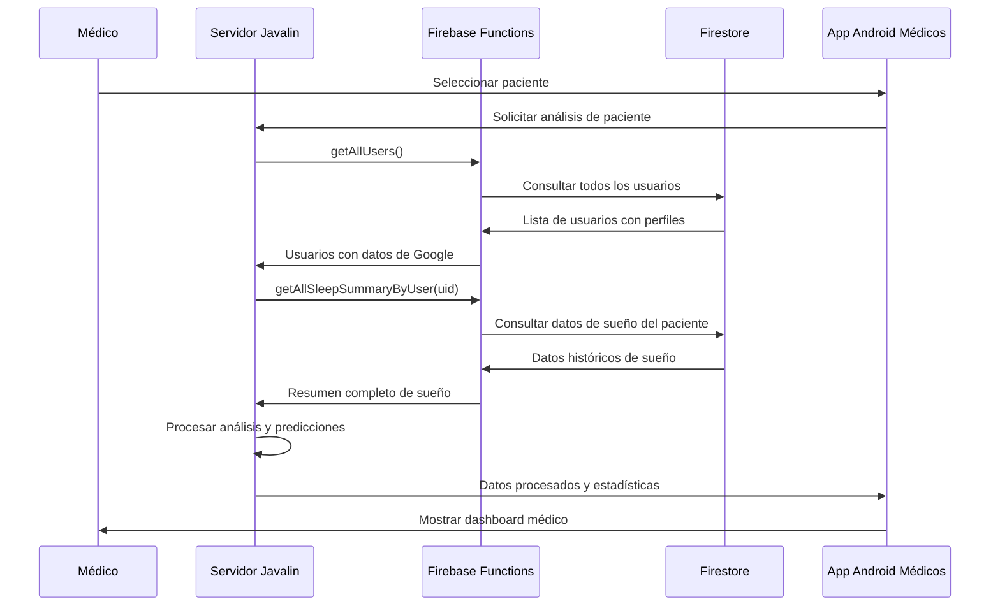

# NOX Sleep Functions - Backend Serverless

## Índice
1. [Introducción](#introducción)
2. [Objetivo General](#objetivo-general)
3. [Objetivos Específicos](#objetivos-específicos)
4. [Arquitectura del Sistema](#arquitectura-del-sistema)
5. [Configuración de Firebase](#configuración-de-firebase)
6. [Funciones Principales](#funciones-principales)
7. [Registro de Funciones en index.ts](#registro-de-funciones-en-indexts)
8. [Flujos de Uso](#flujos-de-uso)
9. [Despliegue](#despliegue)
10. [Posibles Errores y Soluciones](#posibles-errores-y-soluciones)
11. [Créditos](#créditos)

---

## Introducción

**`sleep-functions`** es el backend serverless del sistema **NOX** de **XIADANOS Corporation S.A.**, construido sobre Firebase Cloud Functions. Este módulo actúa como la infraestructura backend responsable de recibir, almacenar, procesar y proveer datos de monitoreo del sueño tanto a la aplicación móvil como al servidor de análisis Javalin.

El sistema implementa una arquitectura completamente serverless que permite escalabilidad automática, alta disponibilidad y procesamiento eficiente de datos biométricos provenientes de dispositivos wearables especializados en monitoreo del sueño.

## Objetivo General

Desarrollar e implementar un backend serverless robusto y seguro que permita la gestión integral de datos de monitoreo del sueño, facilitando la recolección desde dispositivos wearables, el almacenamiento estructurado en la nube, y la provisión de información procesada para análisis médico especializado.

## Objetivos Específicos

- **Implementar un CRUD seguro y completo** para la gestión de perfiles de usuario con validación de datos biométricos
- **Registrar datos diarios de sueño** desde la aplicación móvil en Firestore con validación de integridad y prevención de duplicados
- **Proveer datos agregados y resumidos** para análisis médico mediante endpoints especializados de consulta
- **Facilitar el despliegue rápido y confiable** mediante Firebase Functions con configuración automatizada
- **Garantizar la integridad y seguridad** de los datos médicos sensibles cumpliendo con estándares de privacidad
- **Generar estadísticas automatizadas** semanales y mensuales para análisis de tendencias de sueño
- **Integrar autenticación Google** para una experiencia de usuario fluida y segura

## Arquitectura del Sistema



### Flujo de Datos Principal

1. **Recolección**: Dispositivo wearable captura datos biométricos durante el sueño
2. **Transmisión**: Datos se sincronizan con la aplicación móvil vía Bluetooth
3. **Autenticación**: Usuario se autentica con Google Authentication
4. **Validación**: Aplicación móvil envía datos a Cloud Functions para validación
5. **Almacenamiento**: Datos validados se almacenan en Firestore con estructura optimizada
6. **Procesamiento**: Funciones automatizadas generan estadísticas semanales y mensuales
7. **Consulta**: Servidor Javalin obtiene datos para análisis médico especializado
8. **Visualización**: Médicos acceden a análisis mediante aplicación Android especializada

## Configuración de Firebase

### Creación del Proyecto en Firebase

#### Paso 1: Acceder a Firebase Console

1. **Abrir navegador web** y acceder a:
   ```
   https://console.firebase.google.com/
   ```

2. **Iniciar sesión** con cuenta de Google (debe ser una cuenta con permisos administrativos)

#### Paso 2: Crear Nuevo Proyecto

1. **Hacer clic en "Crear un proyecto"** o "Add project"

2. **Configurar información del proyecto**:
   - **Nombre del proyecto**: `nox-sleep-monitoring`
   - **ID del proyecto**: Se genera automáticamente (ej: `nox-sleep-monitoring-a1b2c`)
   - **Ubicación de Analytics**: Seleccionar país apropiado

3. **Configurar Google Analytics** (Paso 2 de 3):
   - ✅ **Habilitar Google Analytics** (recomendado para monitoreo)
   - Seleccionar o crear cuenta de Analytics

4. **Completar creación**: Hacer clic en "Crear proyecto"
   - ⏳ Esperar 1-2 minutos mientras se configura el proyecto

#### Paso 3: Configurar Aplicación Android

1. **En el dashboard principal**, hacer clic en el **ícono de Android** para agregar app

2. **Registrar aplicación Android**:
   - **Nombre del paquete de Android**: `com.xiadanos.nox.sleepmonitoring`
   - **Alias de la app** (opcional): `NOX Sleep Monitor`
   - **Certificado de firma SHA-1**: [Obtener desde Android Studio]
     ```bash
     # Comando para obtener SHA-1 en desarrollo
     keytool -list -v -keystore ~/.android/debug.keystore -alias androiddebugkey -storepass android -keypass android
     ```

3. **Descargar archivo de configuración**:
   - Descargar `google-services.json`
   - Colocar en `WereableApp/appmobile/` del proyecto Android

#### Paso 4: Configurar Aplicación Web (Para Dashboard Médico)

1. **Hacer clic en el ícono web** `</>`

2. **Registrar aplicación web**:
   - **Alias de la app**: `NOX Medical Dashboard`
   - ✅ **Configurar Firebase Hosting** (opcional)

3. **Copiar configuración** del SDK de Firebase para web:
   ```javascript
   const firebaseConfig = {
     apiKey: "tu-api-key",
     authDomain: "nox-sleep-monitoring.firebaseapp.com",
     projectId: "nox-sleep-monitoring",
     storageBucket: "nox-sleep-monitoring.appspot.com",
     messagingSenderId: "123456789",
     appId: "1:123456789:web:abcdef123456"
   };
   ```

### Servicios a Activar

> **📋 Lista de verificación**: Los siguientes servicios DEBEN estar activados para el funcionamiento correcto del sistema NOX.

#### ✅ 1. Firebase Authentication

**Ubicación**: Console > Authentication

**Pasos para activar**:
1. Ir a **Authentication** en el menú lateral
2. Hacer clic en **"Comenzar"** o **"Get started"**
3. Seleccionar pestaña **"Sign-in method"**
4. **Activar proveedor Google**:
   - Hacer clic en **"Google"**
   - ✅ **Habilitar** el toggle
   - **Correo electrónico de soporte del proyecto**: Ingresar email
   - **Guardar**

**Configuraciones adicionales**:
- **Dominios autorizados**: 
  - `localhost` (para desarrollo)
  - Tu dominio de producción
- **Configuración OAuth**: Se configura automáticamente

**🖼️ Lugar para imagen**: *Captura de pantalla del panel de Authentication con Google habilitado*

#### ✅ 2. Firestore Database

**Ubicación**: Console > Firestore Database

**Pasos para activar**:
1. Ir a **Firestore Database** en el menú lateral
2. Hacer clic en **"Crear base de datos"**
3. **Seleccionar modo**:
   - 🔒 **Comenzar en modo de producción** (recomendado)
   - Hacer clic en **"Siguiente"**
4. **Configurar ubicación**:
   - Región: **`nam5` (us-central)** 
   - Hacer clic en **"Listo"**

**Configuración de reglas de seguridad**:
```javascript
rules_version = '2';
service cloud.firestore {
  match /databases/{database}/documents {
    // Usuarios autenticados pueden leer/escribir sus propios datos
    match /users/{userId} {
      allow read, write: if request.auth != null && request.auth.uid == resource.data.uidUser;
    }
    
    // Datos de sueño: solo el usuario propietario
    match /user_data_sleep/{document} {
      allow read, write: if request.auth != null && request.auth.uid == resource.data.uidUser;
    }
  }
}
```

**🖼️ Lugar para imagen**: *Captura de pantalla del dashboard de Firestore con colecciones creadas*

#### ✅ 3. Cloud Functions

**Ubicación**: Console > Functions

**Pasos para activar**:
1. Ir a **Functions** en el menú lateral
2. Hacer clic en **"Comenzar"**
3. **Configurar facturación**:
   - ⚠️ **Plan Blaze requerido** (pago por uso)
   - Hacer clic en **"Actualizar proyecto"**
4. **Seleccionar configuración**:
   - **Runtime**: Node.js 20
   - **Región**: `us-central1`

**Configuraciones importantes**:
- **Memoria asignada**: 256 MB (por defecto)
- **Timeout**: 60 segundos (por defecto)
- **Variables de entorno**: Se configuran desde código

**🖼️ Lugar para imagen**: *Captura de pantalla del dashboard de Functions mostrando las funciones desplegadas*

#### ✅ 4. Cloud Storage (Opcional)

**Ubicación**: Console > Storage

**Pasos para activar**:
1. Ir a **Storage** en el menú lateral
2. Hacer clic en **"Comenzar"**
3. **Configurar reglas de seguridad**:
   ```javascript
   rules_version = '2';
   service firebase.storage {
     match /b/{bucket}/o {
       match /{allPaths=**} {
         allow read, write: if request.auth != null;
       }
     }
   }
   ```
4. **Seleccionar ubicación**: `nam5` (consistente con Firestore)

**Uso en el proyecto**:
- Almacenamiento de avatares de usuario
- Archivos de configuración
- Logs y reportes exportados

**🖼️ Lugar para imagen**: *Captura de pantalla del bucket de Storage*

#### ✅ 5. Firebase Hosting (Opcional - Para Dashboard Web)

**Ubicación**: Console > Hosting

**Pasos para activar**:
1. Ir a **Hosting** en el menú lateral
2. Hacer clic en **"Comenzar"**
3. **Instalar Firebase CLI** (si no está instalado):
   ```bash
   npm install -g firebase-tools
   ```
4. **Configurar dominio**:
   - Dominio por defecto: `nox-sleep-monitoring.web.app`
   - Dominio personalizado (opcional): `dashboard.nox.com`

**🖼️ Lugar para imagen**: *Captura de pantalla del panel de Hosting*

#### 📊 Dashboard de Servicios Activados

| Servicio | Estado | Propósito | Configuración |
|----------|--------|-----------|---------------|
| 🔐 **Authentication** | ✅ Activo | Autenticación Google | Proveedor Google habilitado |
| 🗄️ **Firestore** | ✅ Activo | Base de datos NoSQL | Modo producción, región nam5 |
| ⚡ **Functions** | ✅ Activo | Backend serverless | Node.js 20, Plan Blaze |
| 📁 **Storage** | ⚠️ Opcional | Almacenamiento archivos | Reglas autenticadas |
| 🌐 **Hosting** | ⚠️ Opcional | Dashboard web | Dominio configurado |
| 📈 **Analytics** | ✅ Recomendado | Métricas de uso | Cuenta vinculada |

### Ubicaciones para Agregar Imágenes en la Documentación

#### 🖼️ Imágenes Recomendadas por Sección:

1. **Creación de Proyecto**:
   - `firebase-console-homepage.png`: Página principal de Firebase Console
   - `create-project-step1.png`: Formulario de creación de proyecto
   - `project-overview.png`: Dashboard principal del proyecto creado

2. **Authentication**:
   - `auth-get-started.png`: Pantalla inicial de Authentication
   - `auth-google-setup.png`: Configuración del proveedor Google
   - `auth-authorized-domains.png`: Lista de dominios autorizados

3. **Firestore Database**:
   - `firestore-create-database.png`: Proceso de creación de base de datos
   - `firestore-collections-view.png`: Vista de colecciones creadas
   - `firestore-rules-editor.png`: Editor de reglas de seguridad

4. **Cloud Functions**:
   - `functions-dashboard.png`: Dashboard de funciones desplegadas
   - `functions-logs.png`: Vista de logs de funciones
   - `functions-metrics.png`: Métricas de rendimiento

5. **Project Settings**:
   - `project-config-web.png`: Configuración del SDK web
   - `project-service-accounts.png`: Cuentas de servicio configuradas

#### 📁 Estructura Sugerida para Imágenes:

```
sleep-functions/
├── docs/
│   ├── images/
│   │   ├── firebase-setup/
│   │   │   ├── 01-console-homepage.png
│   │   │   ├── 02-create-project.png
│   │   │   ├── 03-project-overview.png
│   │   │   └── ...
│   │   ├── authentication/
│   │   │   ├── auth-setup.png
│   │   │   ├── google-provider.png
│   │   │   └── ...
│   │   ├── firestore/
│   │   │   ├── database-creation.png
│   │   │   ├── collections-view.png
│   │   │   └── ...
│   │   └── functions/
│   │       ├── functions-dashboard.png
│   │       └── ...
│   └── README.md
```

**🔗 Referencias de imágenes en Markdown**:
```markdown

*Figura 1: Formulario de creación de nuevo proyecto en Firebase Console*
```

#### Firebase Authentication
- **Método de autenticación**: Google Sign-In
- **Dominios autorizados**: Configurar según ambiente (localhost para desarrollo)
- **Configuración OAuth**: Configurar Client ID y Secret

#### Firestore Database
- **Modo**: Producción
- **Región**: `nam5`
- **Reglas de seguridad**: Configurar acceso basado en autenticación

#### Cloud Functions
- **Runtime**: Node.js 20
- **Región**: `us-central1`
- **Facturación**: Plan Blaze (requerido para funciones)

#### Cloud Storage (Opcional)
- **Bucket por defecto**: Para almacenamiento de archivos adicionales
- **Reglas de seguridad**: Acceso autenticado únicamente

### Verificación de Configuración Completa

#### Lista de Verificación Final

Antes de proceder con el desarrollo, verificar que todos los elementos estén configurados:

**✅ Proyecto Firebase**:
- [ ] Proyecto creado con nombre `nox-sleep-monitoring`
- [ ] Google Analytics habilitado
- [ ] Aplicación Android registrada con `google-services.json` descargado
- [ ] Aplicación Web registrada (opcional para dashboard médico)

**✅ Servicios Activados**:
- [ ] Authentication con proveedor Google habilitado
- [ ] Firestore Database en modo producción, región `nam5`
- [ ] Cloud Functions con Plan Blaze activo
- [ ] Storage configurado (opcional)
- [ ] Hosting configurado (opcional)

**✅ Configuración Local**:
- [ ] Firebase CLI instalado (`npm install -g firebase-tools`)
- [ ] Proyecto inicializado localmente (`firebase init`)
- [ ] Variables de entorno configuradas
- [ ] Dependencias instaladas (`npm install`)

#### Comandos de Verificación

**Verificar instalación de Firebase CLI**:
```bash
firebase --version
# Debe mostrar: 13.x.x o superior
```

**Verificar proyecto activo**:
```bash
firebase projects:list
firebase use nox-sleep-monitoring
```

**Probar conexión con emuladores**:
```bash
cd functions
npm run build
firebase emulators:start
```

**Verificar funciones en la consola**:
- Acceder a http://localhost:5000
- Verificar que todos los emuladores estén ejecutándose
- Probar endpoint de prueba desde Postman o curl

### Configuración de Variables de Entorno

Crear archivo `.env` en el directorio `functions/`:

```bash
# Firebase Configuration
FIREBASE_PROJECT_ID=nox-sleep-monitoring
FIREBASE_REGION=nam5

# API Keys (si es necesario para integraciones externas)
EXTERNAL_API_KEY=your_api_key_here

# Configuración de timezone
TIMEZONE=America/Mexico_City
```

### Configuración Local con Firebase Emulators

El archivo `firebase.json` incluye configuración completa para emuladores:

```json
{
  "emulators": {
    "auth": { "port": 9099 },
    "functions": { "port": 5001 },
    "firestore": { "port": 8080 },
    "database": { "port": 9000 },
    "pubsub": { "port": 8085 },
    "ui": { "enabled": true, "port": 5000 }
  }
}
```

**Inicializar emuladores locales:**
```bash
firebase emulators:start
```

**Acceder a Emulator UI:**
```
http://localhost:5000
```

## Funciones Principales

### Flujo Principal: `registerUserSleepData`

**Endpoint**: `POST /registerUserSleepData`

**Objetivo**: Recibir y almacenar datos completos de sesiones de sueño desde la aplicación móvil.

**Descripción del flujo**: 
La aplicación móvil envía datos de sueño recopilados del dispositivo wearable. La función valida la estructura de datos, verifica que no existan duplicados, calcula métricas de calidad de datos y almacena la información en Firestore con un ID único generado a partir del UID del usuario, fecha y timestamp.

**Quién la llama**: Aplicación móvil Android

**Datos de entrada**:
```json
{
  "uidUser": "firebase_uid_123",
  "date": "2024-07-01",
  "startTime": "2024-07-01T22:30:00Z",
  "endTime": "2024-07-02T06:30:00Z",
  "sleepDuration": 420,
  "quality": 85,
  "sleepEfficiency": 92,
  "lightSleepMinutes": 200,
  "deepSleepMinutes": 120,
  "remSleepMinutes": 80,
  "awakeDuration": 20,
  "awakeningsCount": 2,
  "avgHeartRate": 60,
  "avgRmssd": 45,
  "sleepPhaseData": [
    {
      "timestamp": "2024-07-01T22:30:00Z",
      "phase": "light",
      "hr_bpm": 65,
      "hrv_rmssd": 42.5,
      "hrv_sdnn": 38.2,
      "movement": 0.1
    }
  ]
}
```

**Datos de salida**:
```json
{
  "success": true,
  "message": "Sleep data registered successfully",
  "data": {
    "documentId": "firebase_uid_123_2024-07-01_1719872400000",
    "date": "2024-07-01",
    "startTime": "2024-07-01T22:30:00Z",
    "userId": "firebase_uid_123",
    "totalMeasurements": 480,
    "sleepDuration": 420,
    "sleepEfficiency": 92,
    "quality": 85
  }
}
```

**Uso en el flujo global**: Esta función es el punto de entrada principal para todos los datos de sueño. Se ejecuta cada vez que el usuario sincroniza datos del dispositivo wearable con la aplicación móvil.

---

### Funciones de Usuario (`user`)

#### `searchUser`

**Endpoint**: `GET /searchUser?uidUser={firebase_uid}`

**Objetivo**: Verificar si un usuario ha completado el proceso de registro en el sistema.

**Descripción del flujo**: 
Tras la autenticación con Google, la aplicación móvil consulta esta función para determinar si el usuario debe completar el formulario de registro con datos biométricos o si puede proceder directamente a la funcionalidad principal.

**Quién la llama**: Aplicación móvil Android (después de Google Sign-In)

**Datos de entrada**: 
- **Query parameter**: `uidUser` (Firebase Authentication UID)

**Datos de salida**:
```json
// Usuario registrado
{
  "message": "User has completed the registration form",
  "status": true
}

// Usuario no registrado
{
  "message": "User has not completed the registration form", 
  "status": false
}
```

**Uso en el flujo global**: Determina el flujo de navegación inicial de la aplicación móvil después de la autenticación.

---

#### `registerUser`

**Endpoint**: `POST /registerUser`

**Objetivo**: Registrar un nuevo usuario en el sistema con sus datos biométricos básicos.

**Descripción del flujo**: 
Cuando un usuario nuevo (identificado por `searchUser`) accede por primera vez, debe completar un formulario con información biométrica básica. Esta función valida y almacena estos datos en Firestore.

**Quién la llama**: Aplicación móvil Android (formulario de registro inicial)

**Datos de entrada**:
```json
{
  "uidUser": "firebase_uid_123",
  "weightKg": 70.5,
  "heightCm": 175,
  "age": 28,
  "sex": "M"
}
```

**Datos de salida**: 
- **201**: `"User registered successfully"`
- **400**: `"User with this UID already exists"`

**Uso en el flujo global**: Completar el perfil de usuario necesario para cálculos de métricas personalizadas de sueño.

---

#### `getUserByUid`

**Endpoint**: `GET /getUserByUid?uidUser={firebase_uid}`

**Objetivo**: Obtener los datos completos del perfil de un usuario específico.

**Descripción del flujo**: 
Recupera toda la información del perfil del usuario almacenada en Firestore, incluyendo datos biométricos y metadatos del documento.

**Quién la llama**: Aplicación móvil Android y servidor Javalin

**Datos de entrada**: 
- **Query parameter**: `uidUser` (Firebase Authentication UID)

**Datos de salida**:
```json
{
  "id": "firestore_doc_id_123",
  "data": {
    "uidUser": "firebase_uid_123",
    "weightKg": 70.5,
    "heightCm": 175,
    "age": 28,
    "sex": "M"
  }
}
```

**Uso en el flujo global**: Obtener datos del usuario para personalización de métricas y análisis médico.

---

#### `updateUser`

**Endpoint**: `PUT /updateUser?uidUser={firebase_uid}`

**Objetivo**: Actualizar la información del perfil de un usuario existente.

**Descripción del flujo**: 
Permite modificar los datos biométricos del usuario (peso, altura, edad, sexo) que pueden cambiar con el tiempo y afectar los cálculos de métricas de sueño.

**Quién la llama**: Aplicación móvil Android (configuración de perfil)

**Datos de entrada**:
```json
{
  "weightKg": 72.0,
  "age": 29
}
```

**Datos de salida**: 
- **200**: `"User updated successfully"`

**Uso en el flujo global**: Mantener actualizada la información biométrica para cálculos precisos de métricas.

---

#### `deleteUser`

**Endpoint**: `DELETE /deleteUser?uidUser={firebase_uid}`

**Objetivo**: Eliminar permanentemente la cuenta de un usuario y todos sus datos asociados.

**Descripción del flujo**: 
Elimina el documento del usuario de Firestore. **Nota**: Actualmente solo elimina el perfil del usuario; se requiere implementar eliminación en cascada de todos los datos de sueño asociados.

**Quién la llama**: Aplicación móvil Android (configuración de cuenta)

**Datos de entrada**: 
- **Query parameter**: `uidUser` (Firebase Authentication UID)

**Datos de salida**: 
- **200**: `"User deleted successfully"`

**Uso en el flujo global**: Cumplimiento de regulaciones de privacidad (GDPR, derecho al olvido).

---

### Funciones de Análisis (`dataSummary`)

#### `getAllSleepSummaryByUser`

**Endpoint**: `GET /getAllSleepSummaryByUser?uid={firebase_uid}`

**Objetivo**: Obtener un resumen completo de todas las sesiones de sueño de un usuario específico.

**Descripción del flujo**: 
Consulta todos los documentos de sueño del usuario en Firestore, extrae las métricas principales y las devuelve ordenadas por fecha para análisis de tendencias y visualización.

**Quién la llama**: Servidor Javalin (para análisis médico)

**Datos de entrada**: 
- **Query parameter**: `uid` (Firebase Authentication UID)

**Datos de salida**:
```json
{
  "success": true,
  "data": [
    {
      "date": "2024-07-01",
      "quality": 85,
      "sleepEfficiency": 92,
      "sleepDuration": 420,
      "light": 200,
      "deep": 120,
      "rem": 80,
      "awake": 20,
      "avgHR": 60,
      "avgHRV": 45,
      "awakenings": 2
    }
  ]
}
```

**Uso en el flujo global**: Proporcionar datos históricos para análisis médico especializado y generación de reportes.

---

#### `getAllUsers`

**Endpoint**: `GET /getAllUsers`

**Objetivo**: Obtener la lista completa de usuarios registrados con información de perfil enriquecida.

**Descripción del flujo**: 
Consulta todos los usuarios en Firestore y enriquece cada registro con información del perfil de Google (nombre de usuario y foto de perfil) obtenida de Firebase Authentication.

**Quién la llama**: Servidor Javalin y aplicación Android para médicos

**Datos de entrada**: Ninguna (endpoint público autenticado)

**Datos de salida**:
```json
[
  {
    "uidUser": "firebase_uid_123",
    "weightKg": 70.5,
    "heightCm": 175,
    "age": 28,
    "sex": "M",
    "username": "John Doe",
    "profilePictureUrl": "https://lh3.googleusercontent.com/..."
  }
]
```

**Uso en el flujo global**: Permitir a los médicos seleccionar pacientes para análisis desde la aplicación Android especializada.

---

### Funciones de Estadísticas Automatizadas

El sistema incluye funciones adicionales para generar estadísticas automatizadas:

- **`generateWeeklyStats`**: Genera estadísticas semanales para un usuario
- **`generateWeeklyStatsForUser`**: Genera estadísticas semanales para un usuario específico
- **`generateAllUsersWeeklyStats`**: Genera estadísticas semanales para todos los usuarios
- **`generateMonthlyStats`**: Genera estadísticas mensuales para un usuario
- **`generateMonthlyStatsForUser`**: Genera estadísticas mensuales para un usuario específico
- **`generateAllUsersMonthlyStats`**: Genera estadísticas mensuales para todos los usuarios

Estas funciones están diseñadas para ejecutarse de forma programada (cron jobs) para mantener actualizadas las estadísticas agregadas.

## Registro de Funciones en index.ts

El archivo `src/index.ts` actúa como el punto de entrada principal que inicializa Firebase Admin SDK y exporta todas las funciones disponibles:

```typescript
import * as admin from "firebase-admin";
admin.initializeApp();

// User management functions
export { 
  registerUser, 
  getUserByUid, 
  deleteUser, 
  updateUser, 
  searchUser 
} from "./user/user";

// Sleep data management functions
export { registerUserSleepData } from "./sleep/dailyStats/registerDataSleepUser";

// Statistics functions
export { generateWeeklyStats } from "./sleep/weeklyStats/generateWeeklyStats";
export { generateMonthlyStats } from "./sleep/monthlyStats/generateMonthlyStats";

// Analytics functions
export { getAllSleepSummaryByUser } from "./dataSummary/sleepSummary";
export { getAllUsers } from "./dataSummary/userJson";
```

**Características importantes**:
- **Inicialización única** de Firebase Admin SDK
- **Exportación selectiva** de funciones (solo se despliegan las funciones exportadas)
- **Organización modular** por funcionalidad (user, sleep, dataSummary)
- **Nomenclatura descriptiva** para facilitar identificación en Firebase Console

## Flujos de Uso

### 1. Flujo de Autenticación y Registro de Usuario



### 2. Flujo Principal de Datos de Sueño



### 3. Flujo de Análisis de Datos para Médicos



## Despliegue

### Despliegue Local con Emuladores

**1. Instalar dependencias**:
```bash
cd functions
npm install
```

**2. Construir proyecto TypeScript**:
```bash
npm run build
```

**3. Iniciar emuladores**:
```bash
firebase emulators:start
```

**4. Acceder a servicios locales**:
- **Emulator UI**: http://localhost:5000
- **Functions**: http://localhost:5001
- **Firestore**: http://localhost:8080
- **Authentication**: http://localhost:9099

**5. Modo de desarrollo con watch**:
```bash
npm run build:watch
```

### Despliegue en la Nube con Firebase

**1. Autenticar con Firebase CLI**:
```bash
firebase login
```

**2. Configurar proyecto activo**:
```bash
firebase use nox-sleep-monitoring
```

**3. Desplegar solo funciones**:
```bash
firebase deploy --only functions
```

**4. Desplegar funciones específicas**:
```bash
firebase deploy --only functions:registerUserSleepData,functions:searchUser
```

**5. Verificar despliegue**:
```bash
firebase functions:log
```

### Buenas Prácticas de Despliegue

- **Testing local**: Siempre probar con emuladores antes del despliegue
- **Despliegue incremental**: Desplegar funciones críticas individualmente
- **Monitoreo**: Configurar alertas para errores en producción
- **Rollback**: Mantener versiones anteriores para rollback rápido
- **Variables de entorno**: Usar Firebase Config para configuración sensible

## Posibles Errores y Soluciones

### Errores de Conexión a Firebase

**Error**: `Firebase configuration object is invalid`

**Solución**:
```bash
# Verificar configuración del proyecto
firebase projects:list

# Re-inicializar proyecto si es necesario
firebase init
```

**Error**: `Insufficient permissions`

**Solución**:
- Verificar roles de IAM en Google Cloud Console
- Asegurar que el service account tenga permisos de Firestore y Cloud Functions

### Problemas con Credenciales

**Error**: `Service account key not found`

**Solución**:
1. Generar nueva clave de service account en Google Cloud Console
2. Descargar archivo JSON de credenciales
3. Configurar variable de entorno:
   ```bash
   export GOOGLE_APPLICATION_CREDENTIALS="path/to/serviceAccount.json"
   ```

**Error**: `Auth domain not authorized`

**Solución**:
- Agregar dominio en Firebase Console > Authentication > Settings > Authorized domains

### Errores de CORS y Permisos en Firestore

**Error**: `CORS policy: No 'Access-Control-Allow-Origin' header`

**Solución**:
```typescript
// Añadir headers CORS en funciones HTTP
res.set('Access-Control-Allow-Origin', '*');
res.set('Access-Control-Allow-Methods', 'GET, POST, PUT, DELETE');
res.set('Access-Control-Allow-Headers', 'Content-Type');
```

**Error**: `Missing or insufficient permissions`

**Solución**:
- Revisar reglas de Firestore en `firestore.rules`
- Verificar autenticación del usuario
- Confirmar estructura de datos y permisos de colección

### Errores de Validación de Datos

**Error**: `Validation error: Invalid sleep data format`

**Solución**:
- Verificar que todos los campos requeridos estén presentes
- Revisar tipos de datos (números, strings, fechas)
- Consultar esquema de validación Zod en el código

### Problemas de Rendimiento

**Error**: `Function timeout after 60s`

**Solución**:
```typescript
// Aumentar timeout en configuración de función
export const longRunningFunction = onRequest({
  timeoutSeconds: 300,
  memory: "1GB"
}, async (req, res) => {
  // función de larga duración
});
```

### Errores de Despliegue

**Error**: `Build failed: TypeScript compilation errors`

**Solución**:
```bash
# Verificar errores de TypeScript
npm run build

# Corregir errores de sintaxis y tipos
# Reinstalar dependencias si es necesario
npm install
```

## Créditos

### Equipo de Desarrollo

**XIADANOS Corporation S.A.**
- **Proyecto**: Sistema NOX de Monitoreo del Sueño
- **Módulo**: Backend Serverless (sleep-functions)
- **Tecnologías**: Firebase Cloud Functions, TypeScript, Node.js 20

### Tecnologías Utilizadas

| Tecnología | Versión | Propósito |
|------------|---------|-----------|
| **Firebase Cloud Functions** | v6.0.1 | Backend serverless |
| **Firebase Admin SDK** | v12.6.0 | Gestión de servicios Firebase |
| **TypeScript** | v5.7.3 | Desarrollo con tipado estático |
| **Node.js** | 20 | Runtime de ejecución |
| **Zod** | v3.25.64 | Validación de esquemas de datos |
| **Axios** | v1.10.0 | Cliente HTTP para integraciones |

### Arquitectura del Sistema

- **Frontend móvil**: Android (Kotlin/Java)
- **Dispositivo IoT**: Wearable con Bluetooth
- **Backend**: Firebase Cloud Functions (TypeScript)
- **Base de datos**: Firestore NoSQL
- **Autenticación**: Firebase Authentication (Google)
- **Análisis**: Servidor Javalin (Kotlin)
- **Interfaz médica**: Android especializada

### Licencia y Uso

Este proyecto es propiedad de **XIADANOS Corporation S.A.** y está destinado exclusivamente para el sistema de monitoreo del sueño NOX. El uso, modificación o distribución requiere autorización expresa de la empresa.

**Contacto**: 
- **Empresa**: XIADANOS Corporation S.A.
- **Proyecto**: Sistema NOX
- **Documentación**: Generada el 12 de agosto de 2025

---